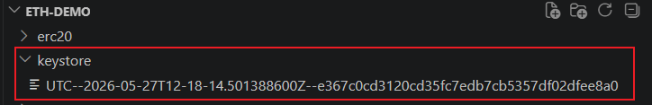
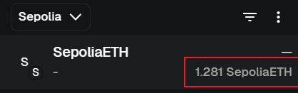
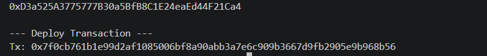
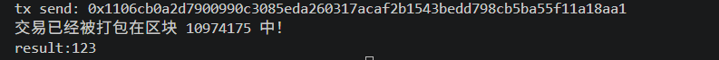
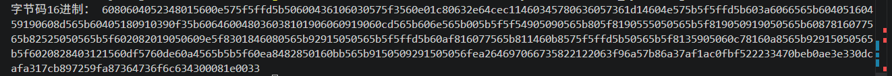
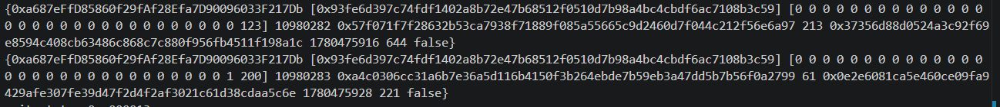
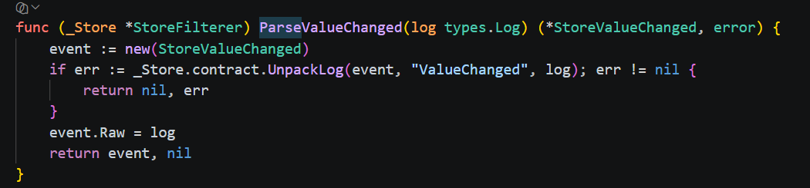
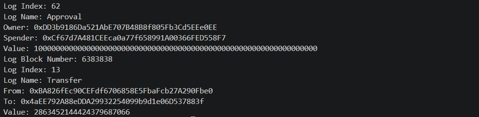
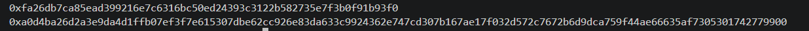
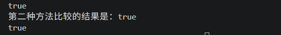

# go-ethereum

## 客户端连接

借用区块链节点rpc服务商

### 连接示例

`connect.go`

~~~go
package main

import (
	"context"
	"fmt"
	"log"
	"github.com/ethereum/go-ethereum/ethclient"
)

func main() {
	client, err := ethclient.Dial("https://sepolia.infura.io/v3/your_private_key")
	if err != nil {
		log.Fatal(err)
	}
	defer client.Close()
	fmt.Println("We have a connection")
	// 在 fmt.Println("We have a connection") 后面加上这验证：
	header, err := client.HeaderByNumber(context.Background(), nil)
	if err != nil {
		log.Fatal("虽然连上了，但无法获取区块数据:", err)
	}
	fmt.Println("最新区块号:", header.Number.String())
}

~~~

> 说明：
>
> `ethclient.Dial(...)` 的作用`如果连接成功，就会返回一个client对象，如果连接失败，返回错误信息给err，后续的`if err != nil` 的拦截机制，一般就可以判断是否连接上了。
>
> 但是，有个潜在陷阱。`ethclient.Dial` 内部使用的是 HTTP 协议（因为你的 URL 是 `https://`）。
>
> 对于 HTTP 连接，`Dial` 函数有时**只验证 URL 格式是否合法**，而不一定会立即向远端服务器发送一次真正的 ping 请求。也就是说，如果你的网络彻底断开，它会报错；但如果你网络正常，仅仅是 Infura 的服务暂时宕机，它在这一步可能不会报错，而是在你后面真正去查询余额或发送交易时才会报错。
>
> 如果你想**百分之百确保**不仅连上了，而且节点完全正常可用，建议在后面加一个真正的区块链查询，比如获取当前最新区块号。

### 访问主网

#### 情况说明

1.sepolia：开不开代理，都可以正常访问。

2.mainnet：由于网络原因，主网直接访问会被墙，需要开代理。开启代理之后，报错信息`dial tcp [2a03:2880:f131:83:face:b00c:0:25de]:443: connectex: A connection attempt failed because the`

#### 解决办法

方式一：修改代码

~~~go
package main

import (
	"context"
	"fmt"
	"log"
	"net/http"
	"net/url"

	"github.com/ethereum/go-ethereum/common"
	"github.com/ethereum/go-ethereum/ethclient"
	"github.com/ethereum/go-ethereum/rpc"
)

func main() {
	// 1. 定义你的代理软件本地端口
	proxyUrl, err := url.Parse("http://127.0.0.1:7897")
	if err != nil {
		log.Fatalf("代理地址解析失败: %v", err)
	}

	// 2. 创建带有代理的 Transport
	transport := &http.Transport{
		Proxy: http.ProxyURL(proxyUrl),
	}

	// 3. 包装成 HttpClient 并设置超时
	httpClient := &http.Client{
		Transport: transport,
		Timeout:   15 * time.Second,
	}
	// client, err := ethclient.Dial("https://mainnet.infura.io/v3/your_private_key")
	rawUrl := "https://mainnet.infura.io/v3/your_private_key"
	rpcClient, err := rpc.DialOptions(context.Background(), rawUrl, rpc.WithHTTPClient(httpClient))
	if err != nil {
		log.Fatal(err)
	}
	// 4. 将底层的 RPC 客户端封装进 ethclient
	client := ethclient.NewClient(rpcClient)
	defer client.Close()

	account := common.HexToAddress("0x71c7656ec7ab88b098defb751b7401b5f6d8976f")
	balance, err := client.BalanceAt(context.Background(), account, nil)
	if err != nil {
		log.Fatal(err)
	}
	fmt.Println(balance) // 2589318016117300503
}
~~~

> 代码不再交由系统盲目解析，而是**强制**把针对主网的所有请求，原封不动地打包塞给本地代理端口。
>
> go程序在访问以太坊主网时，由于代理里规则中没有主网的映射，选择直连，直接就撞墙了。
>
> 1.`mainnet.infura.io` 这个域名**没有被包含**在你代理软件的自动翻墙列表里。
>
> 2.代理软件把它当成了“国内普通网站”，判定为 **Direct（直连）**。
>
> 3.结果：请求绕过了代理，直接赤裸裸地走国内网络去解析 DNS，瞬间踩中“DNS 污染”陷阱。报错信息里暴露的 IP 地址 `[2a03:2880:f131:83:face:b00c:0:25de]` 根本不是 Infura 的，而是 **Meta (Facebook)** 的 IP。国内运营商的 DNS 服务器对 `mainnet.infura.io` 进行了**劫持/污染**，故意给了一个错误的海外 IP。

缺点：代码臃肿，换了环境还需要修改代码。

方式二：配置环境变量

~~~go
package main

import (
	"context"
	"fmt"
	"log"

	"github.com/ethereum/go-ethereum/ethclient"
)

func main() {
	client, err := ethclient.Dial("https://mainnet.infura.io/v3/your_private_key")
	if err != nil {
		log.Fatal(err)
	}
	defer client.Close()
	fmt.Println("We have a connection")
	// 在 fmt.Println("We have a connection") 后面加上这验证：
	header, err := client.HeaderByNumber(context.Background(), nil)
	if err != nil {
		log.Fatal("虽然连上了，但无法获取区块数据:", err)
	}
	fmt.Println("最新区块号:", header.Number.String())
}

~~~

代码不需要修改，只是切换了mainnet网络。

在powershell中添加命令：

~~~powershell
$env:HTTP_PROXY="http://127.0.0.1:7890"
$env:HTTPS_PROXY="http://127.0.0.1:7890"
go run main.go
~~~

这样的话： Go 程序在发请求前，发现有 `HTTPS_PROXY` 变量。程序内部直接把请求目的地改成了 `127.0.0.1:7890`（代理软件的本地端口）。代理软件收到流量时，它看到的不是“一个域名的请求”，而是**你主动塞给它的、明确要求它转发的流量**，因此它会无条件帮你转发出去。

这种设置**只在当前这一个终端窗口（Session）中有效**。一旦你把这个窗口关掉，或者新开一个 PowerShell 窗口，这些环境变量就会自动消失，非常方便和灵活。

扩展：写成配置文件，使用命令的方式

如果你希望每次打开 PowerShell 都能直接用代理，但又不想影响系统其他软件，可以把它们写进 PowerShell 的用户配置文件（Profile）中。

1. 在 PowerShell 中运行：`notepad $PROFILE`（如果提示文件不存在，选择新建）。
2. 在打开的记事本里，写一个自定义的快捷命令（别名）：

~~~powershell
function setproxy {
    $env:HTTP_PROXY="http://127.0.0.1:7890"
    $env:HTTPS_PROXY="http://127.0.0.1:7890"
    echo "当前窗口代理已开启"
}
function clrproxy {
    Remove-Item env:HTTP_PROXY
    Remove-Item env:HTTPS_PROXY
    echo "当前窗口代理已关闭"
}
~~~

3.保存并关闭。以后你每开一个新的 PowerShell，默认是**不带代理**的。只要你想写代码了，敲一下 `setproxy`，当前窗口就一键挂上代理了，非常优雅！

Go项目中命令`go mod tidy`，自动扫描你所有`.go`文件中的import，把缺失的依赖补全，把没用的依赖删除。

## 以太坊账户

### 账户

以太坊上的账户一是钱包地址二是智能合约地址。它们看起来像是`0x71c7656ec7ab88b098defb751b7401b5f6d8976f`，它们用于将ETH发送到另一个用户，并且还用于在需要和区块链交互时指一个智能合约。它们是唯一的，且是从私钥导出的。

要使用go-ethereum的账户地址，您必须先将它们转化为go-ethereum中的`common.Address`类型。

~~~go
address := common.HexToAddress("0x71c7656ec7ab88b098defb751b7401b5f6d8976f")
~~~

### 账户余额

`balance.go`

~~~go
package main

import (
	"context"
	"fmt"
	"log"
	"math"
	"math/big"
	"net/http"
	"net/url"
	"time"

	"github.com/ethereum/go-ethereum/common"
	"github.com/ethereum/go-ethereum/ethclient"
	"github.com/ethereum/go-ethereum/rpc"
)

func main() {
	// 1. 定义你的代理软件本地端口
	proxyUrl, err := url.Parse("http://127.0.0.1:7897")
	if err != nil {
		log.Fatalf("代理地址解析失败: %v", err)
	}

	// 2. 创建带有代理的 Transport
	transport := &http.Transport{
		Proxy: http.ProxyURL(proxyUrl),
	}

	// 3. 包装成 HttpClient 并设置超时
	httpClient := &http.Client{
		Transport: transport,
		Timeout:   15 * time.Second,
	}
	rawUrl := "https://mainnet.infura.io/v3/your_private_key"
	rpcClient, err := rpc.DialOptions(context.Background(), rawUrl, rpc.WithHTTPClient(httpClient))
	if err != nil {
		log.Fatal(err)
	}
	// 4. 将底层的 RPC 客户端封装进 ethclient
	client := ethclient.NewClient(rpcClient)
	defer client.Close()

	account := common.HexToAddress("0x71c7656ec7ab88b098defb751b7401b5f6d8976f")
	balance, err := client.BalanceAt(context.Background(), account, nil)
	if err != nil {
		log.Fatal(err)
	}
	fmt.Println(balance) // 2589318016117300503

	blockNumber := big.NewInt(5532993)
	balanceAt, err := client.BalanceAt(context.Background(), account, blockNumber)
	if err != nil {
		log.Fatal(err)
	}
	fmt.Println(balanceAt)

	fbalance := new(big.Float)
	fbalance.SetString(balanceAt.String())
	ethValue := new(big.Float).Quo(fbalance, big.NewFloat(math.Pow10(18)))
	fmt.Println(ethValue)
}
~~~

### 账户代币余额

`contract_read_erc20.go`

~~~go
package main

import (
	"eth-demo/erc20"
	"fmt"
	"log"
	"math"
	"math/big"

	"github.com/ethereum/go-ethereum/accounts/abi/bind"
	"github.com/ethereum/go-ethereum/common"
	"github.com/ethereum/go-ethereum/ethclient"
)

func main() {
	client, err := ethclient.Dial("https://mainnet.infura.io/v3/your_private_key")
	if err != nil {
		log.Fatal(err)
	}
	defer client.Close()
	// Golem (GNT) Address 2020年迁移，变成GLM，新地址：0x7DD9c5Cba05E151C895FDe1CF355C9A1D5DA6429
	// tokenAddress := common.HexToAddress("0xa74476443119A942dE498590Fe1f2454d7D4aC0d")
	tokenAddress := common.HexToAddress("0x7DD9c5Cba05E151C895FDe1CF355C9A1D5DA6429")
	instance, err := erc20.NewERC20(tokenAddress, client)
	if err != nil {
		log.Fatal(err)
	}

	name, err := instance.Name(&bind.CallOpts{})
	if err != nil {
		log.Fatal(err)
	}
	fmt.Println("Name:", name)

	symbol, err := instance.Symbol(&bind.CallOpts{})
	if err != nil {
		log.Fatal(err)
	}
	fmt.Println("Symbol:", symbol)

	decimals, err := instance.Decimals(&bind.CallOpts{})
	if err != nil {
		log.Fatal(err)
	}
	fmt.Println("Decimals:", decimals)

	balance, err := instance.BalanceOf(&bind.CallOpts{}, common.HexToAddress("0xEB843C7Ca1D19CF530521d7320F66d7A07ed7324"))
	if err != nil {
		log.Fatal(err)
	}
	fmt.Println("Balance:", balance)

	fbalance := new(big.Float)
	fbalance.SetString(balance.String())
	ethValue := new(big.Float).Quo(fbalance, big.NewFloat(math.Pow10(int(decimals))))
	fmt.Printf("balance: %f", ethValue)
}
~~~

其中需要使用ERC20的abi，这里就直接拿到别人编译好的，已经打包成go文件。

在当前项目下创建erc20文件夹，在创建erc20.go

`erc20.go`

~~~go
// Code generated - DO NOT EDIT.
// This file is a binding for a generic ERC20 contract.
package erc20

import (
	"math/big"
	"strings"

	"github.com/ethereum/go-ethereum/accounts/abi"
	"github.com/ethereum/go-ethereum/accounts/abi/bind"
	"github.com/ethereum/go-ethereum/common"
	"github.com/ethereum/go-ethereum/core/types"
)

var ERC20MetaData = &bind.MetaData{
	ABI: "[{\"constant\":true,\"inputs\":[],\"name\":\"name\",\"outputs\":[{\"name\":\"\",\"type\":\"string\"}],\"payable\":false,\"stateMutability\":\"view\",\"type\":\"function\"},{\"constant\":false,\"inputs\":[{\"name\":\"_spender\",\"type\":\"address\"},{\"name\":\"_value\",\"type\":\"uint256\"}],\"name\":\"approve\",\"outputs\":[{\"name\":\"success\",\"type\":\"bool\"}],\"payable\":false,\"stateMutability\":\"nonpayable\",\"type\":\"function\"},{\"constant\":true,\"inputs\":[],\"name\":\"totalSupply\",\"outputs\":[{\"name\":\"\",\"type\":\"uint256\"}],\"payable\":false,\"stateMutability\":\"view\",\"type\":\"function\"},{\"constant\":false,\"inputs\":[{\"name\":\"_from\",\"type\":\"address\"},{\"name\":\"_to\",\"type\":\"address\"},{\"name\":\"_value\",\"type\":\"uint256\"}],\"name\":\"transferFrom\",\"outputs\":[{\"name\":\"success\",\"type\":\"bool\"}],\"payable\":false,\"stateMutability\":\"nonpayable\",\"type\":\"function\"},{\"constant\":true,\"inputs\":[],\"name\":\"decimals\",\"outputs\":[{\"name\":\"\",\"type\":\"uint8\"}],\"payable\":false,\"stateMutability\":\"view\",\"type\":\"function\"},{\"constant\":true,\"inputs\":[{\"name\":\"_owner\",\"type\":\"address\"}],\"name\":\"balanceOf\",\"outputs\":[{\"name\":\"balance\",\"type\":\"uint256\"}],\"payable\":false,\"stateMutability\":\"view\",\"type\":\"function\"},{\"constant\":true,\"inputs\":[],\"name\":\"symbol\",\"outputs\":[{\"name\":\"\",\"type\":\"string\"}],\"payable\":false,\"stateMutability\":\"view\",\"type\":\"function\"},{\"constant\":false,\"inputs\":[{\"name\":\"_to\",\"type\":\"address\"},{\"name\":\"_value\",\"type\":\"uint256\"}],\"name\":\"transfer\",\"outputs\":[{\"name\":\"success\",\"type\":\"bool\"}],\"payable\":false,\"stateMutability\":\"nonpayable\",\"type\":\"function\"},{\"constant\":true,\"inputs\":[{\"name\":\"_owner\",\"type\":\"address\"},{\"name\":\"_spender\",\"type\":\"address\"}],\"name\":\"allowance\",\"outputs\":[{\"name\":\"remaining\",\"type\":\"uint256\"}],\"payable\":false,\"stateMutability\":\"view\",\"type\":\"function\"}]",
}

type ERC20 struct {
	ERC20Caller
	ERC20Transactor
	ERC20Filterer
}

type ERC20Caller struct {
	contract *bind.BoundContract
}

type ERC20Transactor struct {
	contract *bind.BoundContract
}

type ERC20Filterer struct {
	contract *bind.BoundContract
}

func NewERC20(address common.Address, backend bind.ContractBackend) (*ERC20, error) {
	parsed, err := abi.JSON(strings.NewReader(ERC20MetaData.ABI))
	if err != nil {
		return nil, err
	}
	contract := bind.NewBoundContract(address, parsed, backend, backend, backend)
	return &ERC20{ERC20Caller: ERC20Caller{contract: contract}, ERC20Transactor: ERC20Transactor{contract: contract}, ERC20Filterer: ERC20Filterer{contract: contract}}, nil
}

func (_ERC20 *ERC20Caller) Name(opts *bind.CallOpts) (string, error) {
	var out []interface{}
	err := _ERC20.contract.Call(opts, &out, "name")
	if err != nil {
		return "", err
	}
	return *abi.ConvertType(out[0], new(string)).(*string), nil
}

func (_ERC20 *ERC20Caller) Symbol(opts *bind.CallOpts) (string, error) {
	var out []interface{}
	err := _ERC20.contract.Call(opts, &out, "symbol")
	if err != nil {
		return "", err
	}
	return *abi.ConvertType(out[0], new(string)).(*string), nil
}

func (_ERC20 *ERC20Caller) Decimals(opts *bind.CallOpts) (uint8, error) {
	var out []interface{}
	err := _ERC20.contract.Call(opts, &out, "decimals")
	if err != nil {
		return 0, err
	}
	return *abi.ConvertType(out[0], new(uint8)).(*uint8), nil
}

func (_ERC20 *ERC20Caller) BalanceOf(opts *bind.CallOpts, _owner common.Address) (*big.Int, error) {
	var out []interface{}
	err := _ERC20.contract.Call(opts, &out, "balanceOf", _owner)
	if err != nil {
		return nil, err
	}
	return *abi.ConvertType(out[0], new(*big.Int)).(**big.Int), nil
}

func (_ERC20 *ERC20Transactor) Transfer(opts *bind.TransactOpts, _to common.Address, _value *big.Int) (*types.Transaction, error) {
	return _ERC20.contract.Transact(opts, "transfer", _to, _value)
}
~~~

Go项目在import的时候，是根据mod文件中的module xx来引入，所以引入时写入`"eth-demo/erc20"`，其中eth_demo是项目go.mod中`module eth-demo`决定的。

### 生成新钱包

#### 代码示例

`wallet_generate.go`

~~~go
package main

import (
	"crypto/ecdsa"
	"fmt"
	"log"

	"github.com/ethereum/go-ethereum/common/hexutil"
	"github.com/ethereum/go-ethereum/crypto"
)

func main() {
	privateKey, err := crypto.GenerateKey()
	if err != nil {
		log.Fatal(err)
	}

	// ECDSA:椭圆曲线数字签名算法
	privateKeyBytes := crypto.FromECDSA(privateKey)
	// hexutil: 16进制字符串,截取前两个字符0X，
	fmt.Println(hexutil.Encode(privateKeyBytes)[2:])

	publicKey := privateKey.Public()
	publicKeyECDSA, ok := publicKey.(*ecdsa.PublicKey)
	if !ok {
		log.Fatal("cannot assert type: publicKey is not of type *crypto.ECDSAPublicKey")
	}

	publicKeyBytes := crypto.FromECDSAPub(publicKeyECDSA)
	fmt.Println(hexutil.Encode(publicKeyBytes)[4:])//生成公钥文本

	// 公共地址其实就是公钥的Keccak-256哈希，然后我们取最后40个字符（20个字节）并用“0x”作为前缀。
	address := crypto.PubkeyToAddress(*publicKeyECDSA)
	fmt.Println(address)

	// 根据公钥使用Keccak256函数手动生成address
	// publicKeyBytes[1:]截取掉第一个字节，也就是0x04，
	// crypto.Keccak256(publicKeyBytes[1:])[12:]，Keccak256生成256位（32字节）字符，地址只需要后20个字节，所以取[12:]
	fmt.Println(hexutil.Encode(crypto.Keccak256(publicKeyBytes[1:])[12:]))

}
~~~

> 补充说明：
>
> hexutil.Encode(privateKeyBytes)[2:]，返回的是string类型，在go中string不允许随心所欲的切片，但是对字符串`[low:high]` 语法是合法的。
>
> 它的底层逻辑是这样的： Go 的 `string` 本质上是一个**只读的字节数组（byte slice）**。当你对一个字符串执行 `[2:]` 时，Go 并没有把它当成字符（Rune）去切片，而是直接去**切分它底层的字节（Bytes）**。
>
> 因为 `hexutil.Encode()` 返回的字符串是一个**十六进制字符串**（形如 `"0x1a2b3c..."`），这类字符串有一个绝对安全的特点：**它所有的字符都是纯 ASCII 字符（0-9, a-f, x）**。
>
> - 在 ASCII 编码中，**一个字符正好等于一个字节**。
> - 因此，`[2:]` 截取掉前两个字节（即 `"0x"`），在视觉和逻辑上就正好等于截取掉了前两个字符。
>
> 潜在的风险：
>
> 如果字符串包含**中文、日文、表情符号等非 ASCII 字符**（UTF-8 编码下，一个汉字通常占 3 个字节），直接用 `[2:]` 就会把字符拆碎，导致**乱码**甚至程序崩溃。
>
> 错误示范：
>
> ~~~go
> s := "你好世界" // 在 UTF-8 中，每个汉字占 3 个字节
> fmt.Println(s[2:]) 
> // 输出结果会是一堆乱码，因为你把“你”字的 3 个字节强行切开了 2 个
> ~~~
>
> 正确截取任意字符串（按字符/Rune）的做法：
>
> 如果你想安全地截取任意 Go 字符串的前两个“字符”，应该先把它转成 `[]rune`：
>
> ```go
> s := "你好世界"
> runes := []rune(s)
> fmt.Println(string(runes[2:])) // 输出: "世界" (安全按字符切片)
> ```

#### 代码解释

##### 类型断言

~~~go
publicKeyECDSA, ok := publicKey.(*ecdsa.PublicKey)
    if !ok {
        log.Fatal("cannot assert type: publicKey is not of type *ecdsa.PublicKey")
    }
~~~

Go中经典的语法糖：接口的类型断言

断言的语法格式是：`接口变量.(目标类型)`，返回两个值，如果断言成功，返回正确的类型；如果断言失败，ok就是false。

确定断言写什么：看源码return的是谁。

| **如果源码里 return 的是...** | **它属于...**   | **你的断言就要写...**           |
| ----------------------------- | --------------- | ------------------------------- |
| `return &a` (带 `&` 符号)     | 指针类型        | `if v, ok := x.(*具体类型); ok` |
| `return a` (不带 `&` 符号)    | 结构体/基础类型 | `if v, ok := x.(具体类型); ok`  |

Go有严格的包隔离机制：如果需要使用其他包里的结构体，必须带上包名作为前缀（如：`ecdsa.PublicKey`）

##### 公钥文本

~~~go
publicKeyBytes := crypto.FromECDSAPub(publicKeyECDSA)
fmt.Println(hexutil.Encode(publicKeyBytes)[4:])
~~~

公钥要截取前4位字符，原因：为了去掉**前缀 `"0x"` + 椭圆曲线非压缩标志位 `"04"`**。

🔑 私钥的字符串结构：

```
" 0x 8a3f... "
 └───┘
 [2:] 截取掉 0x，剩下 64 位纯私钥文本
```

- 私钥只是一个纯粹的大整数，没有状态标志位。所以只有 `"0x"` 这 2 个字符需要剔除。

🛡️ 公钥的字符串结构：

```
" 0x 04 8a3f... "
 └─────┘
 [4:] 截取掉 0x 和 04，剩下 128 位纯公钥坐标文本
```

- 公钥不仅有 `"0x"` 前缀（2字符），还有 `"04"` 这个代表非压缩状态的标志位（2字符）。
- 两个加起来一共 4 个字符，所以必须用 `[4:]` 才能把它们一起切掉，露出后面真正的公钥核心数据。

##### 补充Go知识：指针和取址

~~~go
address := crypto.PubkeyToAddress(*publicKeyECDSA)
~~~

`crypto.PubkeyToAddress`方法里的参数是值类型，而`publicKeyECDSA`是一个指针，需要取出指针所指的值，所以添加`*`号。

一句话核心口诀：

> **`&` 是“把东西变成指针”（取地址）**
>
> **`\*` 是“顺着指针找东西”（解引用）或者“定义指针类型”**

1. `&`（取地址符）：永远只做一件事

`&` 的功能非常纯粹。任何时候，你在一个变量前面加上 `&`，意思就是：**“别给我变量里的值，给我这个变量在内存里的地址！”**

```go
age := 18      // age 是一个普通整数
ptr := &age    // ptr 拿到了 age 的内存地址（ptr 变成了一个指针）
```

- **看代码：** 只要看到 `&`，就是把一个普通的“实物”，打包成了一个“指针（钥匙）”。

2. `*`（星号）：精神分裂，它有两个身份

身份 A：放在【类型】前面 —— 代表“这是一种指针类型”

当 `*` 后面紧跟着一个类型名（如 `int`、`string`、`ecdsa.PublicKey`）时，它代表一个**类型标签**，意思是“这是一个用来装地址的变量”。

```go
var p *int // 这里的 *int 是一个整体类型，表示 p 是一个“指向当前整数的指针”
```

身份 B：放在【变量】前面 —— 代表“解引用（取值）”

当 `*` 后面紧跟着一个**指针变量**时，它是真正的**动词（操作符）**，意思是：“顺着这个指针（钥匙）指示的地址，把里面的**实物**给我掏出来！”

```go
age := 18
ptr := &age   // ptr 是指针

fmt.Println(*ptr) // 这里的 *ptr 就是把地址里的数字 18 掏出来打印。输出: 18
```

`crypto.PubkeyToAddress(*publicKeyECDSA)` 这里的 `*` 就是身份 B。因为 `publicKeyECDSA` 是个指针（钥匙），而函数要的是值（房子），所以你加个 `*`，就是把房子实物掏出来丢给函数。

3. 一张表彻底分清 `&` 和 `*`

我们用最直观的“房子与钥匙”来做个对比：

| **语法符号**     | **怎么用**     | **举例**       | **通俗含义**                                         | **结果的类型**     |
| ---------------- | -------------- | -------------- | ---------------------------------------------------- | ------------------ |
| **`&`**          | 放在**变量**前 | `&me`          | 把我（实物）打包，生成一张通往我家的**钥匙（地址）** | 指针类型（带 `*`） |
| **`\*` (身份A)** | 放在**类型**前 | `var p *House` | 声明一个只能用来装**“房子钥匙”**的盒子               | 类型声明           |
| **`\*` (身份B)** | 放在**变量**前 | `*key`         | 拿着**钥匙**去开门，把里面的**房子实物**搬出来       | 值类型（不带 `*`） |

##### 地址文本字符大小写

`hexutil.Encode` 默认生成的是全小写

在技术层面，十六进制本身是不区分大小写的。也就是说，不管是大写的 `0x90F8...` 还是小写的 `0x90f8...`，在计算机眼里代表的都是同一个以太坊地址。

但是，以太坊中有一个著名的“大小写校验和”机制：

如果你去 Etherscan 区块链浏览器，或者在 MetaMask 小狐狸钱包里看一个地址，你会发现它往往（**大小写混杂**），这是以太坊经典的 **EIP-55 地址校验和（Checksum）规范**。

> 为了**防呆/防输错**。
>
> 由于以太坊地址很长，人类复制粘贴或者手打时极易弄错一个字符（一旦转账转错，资产就永久丢失了）。
>
> 以太坊创始人 Vitalik 提出了一个天才的想法：**利用地址自身字母的大小写来做校验。**
>
> - 它的原理是：把小写地址去掉 `0x`，对其再做一次 Keccak256 哈希。
> - 看哈希结果的第 $i$ 位：如果大于等于 8，就把地址的第 $i$ 位字母变成**大写**；如果小于 8，就保持**小写**。
>
> 当钱包软件（比如 MetaMask）看到你输入一个大小写混杂的地址时，它会在后台自动帮你用这个公式算一遍。如果你不小心抄错了一个字母，大小写对不上，钱包就会立刻警告你：*“地址无效，请检查！”*

建议：

1.**文本本身不区分大小写：** 拿这个全小写的地址去链上转账、查询，完全没有问题。

2.**更安全的做法（推荐）：** 如果你生成的地址是要**展示给用户看**，或者需要高安全性，建议不要用 `hexutil.Encode`。而是使用以太坊官方的 `common` 包。

### 密钥库

#### 介绍

keystore是一个包含经过加密了的钱包私钥，简单理解就是给你的私钥添加了一把“加密锁”，把它变成一个安全的文件。

在实际的区块链应用中，**绝对没有任何一个正规钱包会直接把私钥的明文保存在硬盘上。** 它们都会把私钥转换成 Keystore 文件。

Keystore 本质上是一个普通的 **JSON 文本文件**。如果你用记事本打开它，里面大概长这样：

```json
{
    "address": "90f8bf6a479f320ead074411a4b0e7944ea8c9c1",
    "crypto": {
        "cipher": "aes-128-ctr",
        "ciphertext": "2c5101a1d30...（一堆加密后的乱码）",
        "kdf": "scrypt",
        "mac": "6d3c90a1f..."
    },
    "id": "1a2b3c4d-...",
    "version": 3
}
```

这里面最关键的是：**你看不到真正的私钥。** 真正的私钥被藏在 `ciphertext`（密文）里面了。

> 以太坊团队在设计 Keystore 时，早就料到了人类会用弱密码，所以他们在里面部署了一道特殊的“减速带”——**KDF 算法（密钥派生函数）**。
>
> 在json文件中会看到里面有一个参数叫 `"kdf": "scrypt"`（或者 `pbkdf2`）。这就是以太坊对抗暴力破解的武器。故意“跑的很慢”的算法，`scrypt` 算法有两个恶心黑客的特点：
>
> 1. **故意消耗极大的内存（Memory Hard）**
> 2. **故意消耗大量的 CPU 计算时间**

#### 代码示例

`keystore.go`

~~~go
package main

import (
	"fmt"
	"io/ioutil"
	"log"
	"os"

	"github.com/ethereum/go-ethereum/accounts/keystore"
)

// 生成keystore的方法，存放在keystore目录下
func createKeystore() {
	ks := keystore.NewKeyStore("./keystore", keystore.StandardScryptN, keystore.StandardScryptP)
	password := "password"
	account, err := ks.NewAccount(password)
	if err != nil {
		log.Fatal(err)
	}
	fmt.Println("Address: ", account.Address)
}
// 核心作用：“钱包迁移与归档”。
// 它正在把一个松散在外的、旧的 Keystore 文件，统一收编并同步到你的 Keystore 管理系统（即 ./ks 目录） 中。
// 该方法的使用场景：用户上传了一个他以前的以太坊钱包文件（Keystore），后端系统接收后，对它进行安全升级、
// 统一归档到系统的正式钱包数据库中（./ks），并顺手清理掉上传的临时文件。
func importKs() {
	file := "./keystore/UTC--2026-05-27T12-18-14.501388600Z--e367c0cd3120cd35fc7edb7cb5357df02dfee8a0"
	ks := keystore.NewKeyStore("./ks", keystore.StandardScryptN, keystore.StandardScryptP)
	// jsonBytes, err := ioutil.ReadFile(file)  方法过时
	jsonBytes, err := os.ReadFile(file)
	if err != nil {
		log.Fatal(err)
	}

	password := "password"
	// 该方法接收keystore的JSON数据作为字节,第二个参数是用于加密私钥的口令,第三个参数是指定一个新的加密口令
	account, err := ks.Import(jsonBytes, password, password)
	if err != nil {
		log.Fatal(err)
	}

	fmt.Println(account.Address.Hex()) // 0x20F8D42FB0F667F2E53930fed426f225752453b3

	if err := os.Remove(file); err != nil {
		log.Fatal(err)
	}
}
func main() {
	// createKeystore()
	importKs()
}
~~~

会在当前项目下创建keystore目录，生成文件存放在当前目录下



> 补充：
>
> 直接`mv`移动文件，不也能达到统一管理的目的吗？为什么还要用 Go 代码解密再加密这么麻烦？
>
> 这就涉及到 `keystore.NewKeyStore` 的**统一规范管理**了，主要有三个原因：
>
> 原因一：顺便修改/重置密码
>
> `ks.Import(内容, 旧密码, 新密码)` 支持新旧密码不同。这段代码虽然新旧都用了 `"secret"`，但在实际业务中，这通常用于**用户导入备份钱包并修改密码**的场景：
>
> > 比如你在小狐狸导出了一个旧 Keystore（密码是 123），现在导入到你的新后端系统，你想顺便把密码改成 456。
>
> 原因二：统一加密强度（Scrypt 参数）
>
> 看你初始化的这一行：
>
> ```go
> ks := keystore.NewKeyStore("./ks", keystore.StandardScryptN, keystore.StandardScryptP)
> ```
>
> 这就规定了 `./ks 下的所有钱包文件**必须采用标准的、高强度的密码学参数**。 别人给你的旧 Keystore 文件可能安全强度很低（比如很多年前生成的，算法很落后）。通过 `Import`，Go 会把私钥掏出来，用你指定的 `StandardScrypt` 高强度重新加锁，**完成了安全级别的升级**。
>
> 原因三：注册到内存管理器中
>
> 一旦使用了 `ks.Import`，这个账户就正式在你的 `ks`（KeyStore 管理器）里挂号注册了。后续你如果要调用 `ks.Unlock(account, password)`，`ks` 就能在自己的管辖范围内直接找到它；如果你只是硬生生移动文件过去，`ks` 可能会因为没有刷新索引而找不到这个新来的钱包。

**后续使用**

后续的使用场景主要是“发送交易（转账/调用智能合约）”。因为只有发送交易才需要私钥签名，如果只是查询余额，直接用地址就行。

1. 业务流程（以转账为例）：

- **前端/用户：** 提起转账申请，输入目标地址、金额，并**输入密码**。
- **后端：** 1. 根据用户的以太坊地址，去硬盘上找到对应的 Keystore 文件。 2. 读取文件内容，结合用户输入的密码，调用代码在内存中**解密出私钥**。 3. 用私钥给交易签名。 4. 将签名后的交易广播到区块链网络中。

2. Go 代码落地实现：

在 Go 语言中，你不需要自己去解析 JSON 和做 AES 解密，官方的 `accounts/keystore` 包已经把这些操作封装好了：

```go
import (
    "github.com/ethereum/go-ethereum/accounts/keystore"
    "github.com/ethereum/go-ethereum/common"
    "io/ioutil"
)

func SignTransactionWithKeystore(ksDir string, userAddress string, password string) {
    // 1. 初始化 Keystore 管理器（指向你存放文件的目录）
    ks := keystore.NewKeyStore(ksDir, keystore.StandardScryptN, keystore.StandardScryptP)
    
    // 2. 找到对应的账户
    account := accounts.Account{Address: common.HexToAddress(userAddress)}
    
    // 3. 解锁账户（这一步就是输入密码，在底层解密出私钥并临时存放在内存中）
    err := ks.Unlock(account, password)
    if err != nil {
        log.Fatal("密码错误，解锁失败:", err)
    }
    // 确保用完后重新锁定账户，保障安全
    defer ks.Lock(account.Address)

    // 4. 后续就可以调用交易签名方法了（例如：ks.SignTx(...)）
}
```

#### 创建钱包方式补充

后端创建钱包：用 `crypto` 还是 `keystore`？

在商业级的后端系统中，这两种方式并不是二选一，而是“组合拳”——它们分别承担了不同的系统职责。

我们可以把它们看作是零件（`crypto`）**和**成品（`keystore`）的关系。

1. 两者的本质区别与分工

- **`crypto` 方式（只负责密码学运算）：**
  - 它就像是一个纯粹的数学工具箱（`crypto.GenerateKey()`）。它在内存中啪嗒一下闪电般生成一串私钥、公钥和地址。
  - **特点：** 极快，完全在内存中进行，**不负责保管**。如果你程序关了或者没写保存代码，这把私钥就永远消失了。
- **`keystore` 方式（负责账户的安全生命周期管理）：**
  - 它是一个管家。当你调用 `ks.NewAccount(password)` 时，它在**底层依然会调用 `crypto` 去生成私钥**，但生成之后，它会立马用你给的密码把它加密，并且自动在硬盘上写好一个标准格式的 JSON 文件。

场景 A：你在做“交易所/中心化托管钱包”（比如币安、欧易这类）

- **做法：** 通常使用 **`crypto` 方式** 在内存中生成私钥。
- **为什么：** * 因为中心化系统需要极高的性能（一秒钟要为成千上万个用户生成充值地址）。如果用 `keystore` 方式，每次都要运行慢吞吞的 `scrypt` 算法去写硬盘，服务器会直接卡死。
  - **那私钥怎么存？** 后端用 `crypto` 生成后，会通过内网极安全地传输到专门的 **KMS（密钥管理系统）** 或 **HSM（硬件安全模块）** 中进行物理加密存储，而不会存成硬盘上的 Keystore 文件。

场景 B：你在做“去中心化钱包”的后端，或者独立节点的“自动化脚本/量化机器人”

- **做法：** 使用 **`keystore` 方式**。
- **为什么：**
  - 安全第一，性能要求不高。比如你的量化机器人只需要管理 3 个主网账户，你用 `keystore` 把它们存放在服务器的某个安全目录下。
  - 每次量化程序启动时，通过环境变量或配置读取密码，“解锁（`Unlock`）”账户，然后开始自动化高频交易。这样就算服务器被肉鸡了，黑客没有密码也偷不走 Keystore 里的钱。

总结： 如果是小规模、重安全的本地管理，直接用 **`keystore` 方式** 自动生成并落盘；如果是大规模、高并发的中心化系统，用 **`crypto` 方式** 在内存中快速生成，然后接入专业的密钥托管系统（如 HashiCorp Vault）。

### 分层确定性钱包

#### 介绍

HD 钱包的核心思想可以用四个字概括：**“一树生万物”**。

它不再随机生成一堆乱七八糟的私钥，而是通过一个**初代的随机数（我们称之为“种子”，Seed）**，像种树一样，无限衍生出一个树状结构的私钥和公钥矩阵。

1. 它是怎么变出这么多私钥的？

你肯定听过“助记词（Mnemonic）”。HD 钱包会把那串复杂的“种子”变成人类容易抄写的 12 个或 24 个英文单词（比如 `apple banana...`）。

- **只要你牢牢记住这 12 个单词，你就等于拥有了整棵树的根。**
- 哪怕你的电脑炸了、手机丢了，你在新设备上输入这 12 个单词，HD 钱包算法就能瞬间把你所有的子私钥、孙私钥、几十上百个地址**原封不动地全部重新推算出来**！

2. “分层（Hierarchical）”是什么意思？

它是按照一条“路径（Path）”来管理的，长得像文件目录一样： 比如以太坊的默认路径是：`m / 44' / 60' / 0' / 0 / 0`

- `44'` 代表币种符合 BIP44 标准。
- `60'` 专门代表**以太坊（ETH）**（比特币是 `0'`）。
- 后面的数字改一改（比如变成 `0 / 1`、`0 / 2`），就能无限派生出第 2 个、第 3 个以太坊地址。
- 甚至可以分层授权：你可以把“部门 A”那一层的密钥给主管，主管只能看到和管理部门 A 下面的所有子地址，而看不到整个公司（根节点）的其他钱包。

#### HD钱包和普通钱包对比

| **维度**     | **普通钱包（你之前写的 crypto/keystore）**                   | **HD 钱包（分层确定性钱包）**                                |
| ------------ | ------------------------------------------------------------ | ------------------------------------------------------------ |
| **备份难度** | ❌ **极大**。每创建一个新地址，就得备份一个新 Keystore 文件，漏备份一个就可能资产归零。 | **极低**。一辈子只需要备份一次 **12个助记词**，就能管一辈子生成的无限个地址。 |
| **多链支持** | ❌ **不支持**。一个以太坊私钥只能管以太坊和它的 EVM 兼容链。如果是比特币，得另外用算法生成。 | **完美支持**。通过同一组助记词，改一下路径参数，就能同时派生出 BTC、ETH、SOL、DOT 等所有链的私钥。 |
| **隐私性**   | ❌ **较差**。如果你对外公开了一个地址用来收款，别人就能在链上把你的全部余额和流水看个精光。 | **极好**。每次收款都可以自动派生一个全新的子地址，但它们都属于你同一个钱包，做到了隐私隔离。 |
| **权限控制** | ❌ **全凭一把锁**。只要私钥暴露，全部权限丢失。               | **可以分级**。可以只导出某个特定分支的公钥（扩展公钥 xpub），用来只记账、不具有转账权限。 |

> 我们可以把企业级钱包大体分为两类生态：
>
> 1. 中心化系统（托管钱包 / 交易所 / 支付网关）
>
> - **主流选择：** **普通钱包（独立私钥）+ KMS / HSM / MPC（多方安全计算）**
> - **占比：** **约 80%**
> - **为什么不用 HD 钱包？**
>   - **单点故障风险（致命伤）：** HD 钱包的核心是“一树生万物”。这意味着只要根节点的“助记词/种子”泄露，整个企业**所有用户、所有链、过去和未来**的全部资金会瞬间被一网打尽。这在企业风控里是绝对不可接受的。
>   - **并发与数据库瓶颈：** 企业需要为上百万用户生成充值地址。如果用 HD 钱包，你得在数据库里小心翼翼地维护派生索引（Index）。如果索引错乱或高并发下出现空洞，系统推算出来的地址就会对不上，导致用户充值无法入账。
>   - **现代方案替代：** 现在的交易所（如币安、欧易）或托管商（如 Fireblocks），底层虽然生成的是一个个独立的、类似于普通钱包的私钥/地址，但它们使用 **MPC（多方安全计算）技术**，把单个私钥切成三份碎片，分给不同的服务器和多位高管。签名时碎片在内存中相遇，既没有“助记词泄露全盘皆输”的风险，又实现了权限隔离。
>
> 2. 去中心化系统（非托管钱包 / 自动化多链脚本 / 用户自主钱包）
>
> - **主流选择：** **HD 钱包（分层确定性）**
> - **占比：** **约 20%**
> - **为什么用 HD 钱包？**
>   - **用户端标配：** 如果你开发的是一款类似 MetaMask 的 Web3 钱包客户端，让用户自己管理资产，那 HD 钱包是绝对的行业标准。因为你不能指望用户去备份 100 个不同的私钥文件，12 个助记词是人类体验的极限。
>   - **多链归集与量化脚本：** 如果企业自己运营一些量化机器人、或者需要管理几十条公链（BTC、ETH、Solana等）的运营资金账户。使用 HD 钱包，员工只需要保管一套种子，就能自动推算出所有链的地址，非常适合用来做多链资金的批量归集和对账。

企业级开发的思路：

* **个人开发/用户端：** 体验第一，备份要简单，选 **HD 钱包**。
* **企业级开发/服务端：** 风控第一，权限要拆分，不能有单点崩溃风险。因此，大资金流转一律采用**彼此隔离的普通钱包（配合 MPC 碎片或多签合约）**；而在跨链记账、多链自动化管理、或打造用户自主产品时，才会请出 **HD 钱包**。

#### 实现方式

##### 代码方式

在你的 Go 项目中引入这两个核心依赖：

```bash
go get github.com/tyler-smith/go-bip39
go get github.com/miguelmota/go-ethereum-hdwallet
```

> **`go-bip39`**：负责生成人类可读的 12/24 个英文单词（助记词），并将其转化为二进制种子（Seed）。
>
> **`go-ethereum-hdwallet`**：这是一个基于 go-ethereum 封装的、目前最流行的开源 HD 钱包库（由知名开发者 Miguel Mota 编写），它把 BIP32/BIP44 的复杂推导逻辑封装成了极简的 API。

完整代码示例：

```go
package main

import (
	"fmt"
	"log"

	"github.com/miguelmota/go-ethereum-hdwallet"
	"github.com/tyler-smith/go-bip39"
)

func main() {
	// ----------------------------------------------------------------
	// 第一步：生成 12 个英文单词的助记词 (Mnemonic)
	// ----------------------------------------------------------------
	// 128 位熵可以生成 12 个单词，256 位可以生成 24 个单词
	entropy, err := bip39.NewEntropy(128)
	if err != nil {
		log.Fatal("生成熵失败:", err)
	}
	mnemonic, err := bip39.NewMnemonic(entropy)
	if err != nil {
		log.Fatal("生成助记词失败:", err)
	}
	fmt.Println("✨ 你的 12 个助记词（请妥善备份，千万别泄露）:")
	fmt.Printf("👉 %s\n\n", mnemonic)

	// ----------------------------------------------------------------
	// 第二步：通过助记词创建 HD 钱包根节点
	// ----------------------------------------------------------------
	// 这一步在底层会把助记词转成二进制 Seed，再生成 Master Key
	wallet, err := hdwallet.NewFromMnemonic(mnemonic)
	if err != nil {
		log.Fatal("创建HD钱包失败:", err)
	}

	// ----------------------------------------------------------------
	// 第三步：像“剥洋葱”一样，顺着路径派生出多个子账户
	// ----------------------------------------------------------------
	fmt.Println("🛡️ 开始顺着以太坊经典路径派生账户...")
	
	// 循环生成 3 个不同的以太坊地址
	for i := 0; i < 3; i++ {
		// 拼接以太坊标准 BIP44 路径: m/44'/60'/0'/0/i
		pathStr := fmt.Sprintf("m/44'/60'/0'/0/%d", i)
		path := hdwallet.MustParseDerivationPath(pathStr)

		// 派生该路径下的账户
		account, err := wallet.Derive(path, false)
		if err != nil {
			log.Fatal("派生账户失败:", err)
		}

		// 提取该账户对应的私钥明文（方便你导入 MetaMask）
		privateKeyHex, err := wallet.PrivateKeyHex(account)
		if err != nil {
			log.Fatal("获取私钥失败:", err)
		}

		// 打印结果
		fmt.Printf("【账户 #%d】\n", i)
		fmt.Printf("  路径: %s\n", pathStr)
		fmt.Printf("  地址: %s\n", account.Address.Hex())
		fmt.Printf("  私钥: %s\n", privateKeyHex)
		fmt.Println("----------------------------------------")
	}
}
```

运行结果长这样：

不管你运行多少次，只要**助记词不变，派生出来的账户 #0、#1、#2 的地址和私钥就绝对不会变**。

```plaintext
✨ 你的 12 个助记词（请妥善备份，千万别泄露）:
👉 apple banana cherry dog elephant fox grape horse ink jacket kite lemon

🛡️ 开始顺着以太坊经典路径派生账户...
【账户 #0】
  路径: m/44'/60'/0'/0/0
  地址: 0x90F8Bf6A479F320EaD074411a4B0E7944eA8c9c1
  私钥: 8a3f...
----------------------------------------
【账户 #1】
  路径: m/44'/60'/0'/0/1
  地址: 0x11A2b3...
  私钥: c2e4...
----------------------------------------
```

##### 非代码方式

如果你在生产环境中只是想**临时生成**一组安全的助记词，或者在运维、测试时手动验证路径，企业里的工程师通常不会去现写一段 Go 代码，而是使用现成的工具。

1. 终极瑞士军刀：`comit-hd-cli` 或 `bp-hd-cli`

你可以直接在终端使用这类全局命令来生成。以标准的 Node.js 版生态工具为例，可以直接免安装运行：

```bash
npx hd-wallet-cli create
```

输出会直接给你 12 个单词，以及对应的根私钥。

#### 💡 后端后续怎么去“用”它？

在实际业务（如自动化打款、多链财务系统）中，你拿到派生出来的 `account` 之后，怎么用来发交易？

HD 钱包的接口非常丝滑，不需要像 Keystore 那样去读写硬盘文件。在 Go 代码里，签名交易只需要一行：

```go
// 假设你已经构建好了一个未签名的以太坊原生交易对象：tx := types.NewTransaction(...)
// 以及链的 ID：chainID := big.NewInt(1)

// 直接调用 wallet 的 SignTx 方法，传入对应的 account 即可
signedTx, err := wallet.SignTx(account, tx, chainID)
if err != nil {
    log.Fatal("签名失败:", err)
}

// 接下来直接把 signedTx 发送到链上，钱就转出去了！
```

### 地址验证

#### 介绍

检验地址是否有效，可以通过简单的正则表达式来检验是否有效。

~~~go
re := regexp.MustCompile("^0x[0-9a-fA-F]{40}$")

fmt.Printf("is valid: %v\n", re.MatchString("0x323b5d4c32345ced77393b3530b1eed0f346429d")) // is valid: true
fmt.Printf("is valid: %v\n", re.MatchString("0xZYXb5d4c32345ced77393b3530b1eed0f346429d")) // is valid: false
~~~

检查地址是合约还是账户：在该地址存储了字节码，该地址是智能合约；当地址上没有字节码，那就是一个标准的账户。

~~~go
// 0x Protocol Token (ZRX) smart contract address
address := common.HexToAddress("0xe41d2489571d322189246dafa5ebde1f4699f498")
bytecode, err := client.CodeAt(context.Background(), address, nil) // nil is latest block
if err != nil {
  log.Fatal(err)
}

isContract := len(bytecode) > 0

fmt.Printf("is contract: %v\n", isContract) // is contract: true
~~~

#### 代码示例

`check_address.go`[没验证，验证后更改]

~~~go
package main

import (
    "context"
    "fmt"
    "log"
    "regexp"

    "github.com/ethereum/go-ethereum/common"
    "github.com/ethereum/go-ethereum/ethclient"
)

func main() {
    re := regexp.MustCompile("^0x[0-9a-fA-F]{40}$")

    fmt.Printf("is valid: %v\n", re.MatchString("0x323b5d4c32345ced77393b3530b1eed0f346429d")) // is valid: true
    fmt.Printf("is valid: %v\n", re.MatchString("0xZYXb5d4c32345ced77393b3530b1eed0f346429d")) // is valid: false

    client, err := ethclient.Dial("https://mainnet.infura.io")
    if err != nil {
        log.Fatal(err)
    }

    // 0x Protocol Token (ZRX) smart contract address
    address := common.HexToAddress("0xe41d2489571d322189246dafa5ebde1f4699f498")
    bytecode, err := client.CodeAt(context.Background(), address, nil) // nil is latest block
    if err != nil {
        log.Fatal(err)
    }

    isContract := len(bytecode) > 0

    fmt.Printf("is contract: %v\n", isContract) // is contract: true

    // a random user account address
    address = common.HexToAddress("0x8e215d06ea7ec1fdb4fc5fd21768f4b34ee92ef4")
    bytecode, err = client.CodeAt(context.Background(), address, nil) // nil is latest block
    if err != nil {
        log.Fatal(err)
    }

    isContract = len(bytecode) > 0

    fmt.Printf("is contract: %v\n", isContract) // is contract: false
}
~~~

## 交易

### 概念介绍

交易（transaction）是指广义的对以太坊状态的更改，

### 查询区块

### 查询交易

### ETH转账

#### 步骤

1.连接客户端，加载私钥。

2.获取发送发的地址，获取nonce

3.封装要转的ETH数值（单位是wei），设置gasLimit，gasPrice，

4.封装接收方的账户地址

5.使用types.NewTransaction创建一个交易

6.获取chainId，因为在广播的时候，需要携带chainId，以及需要用私钥进行签名

7.types.SignTx对这笔交易进行签名

8.client.SendTransaction进行广播

#### 完整代码

`transfer_eth.go`

~~~go
package main

import (
	"context"
	"crypto/ecdsa"
	"fmt"
	"log"
	"math/big"

	"github.com/ethereum/go-ethereum/common"
	"github.com/ethereum/go-ethereum/core/types"
	"github.com/ethereum/go-ethereum/crypto"
	"github.com/ethereum/go-ethereum/ethclient"
)

func main() {
	client, err := ethclient.Dial("https://sepolia.infura.io/v3/your_private_key")
	if err != nil {
		log.Fatal(err)
	}
	defer client.Close()
    //crypto.HexToECDSA()作用：将人类可读的16进制字符串，解析并转换成Go语言密码学库内部能够识别和使用的标准ECDSA私钥对象
	privateKey, err := crypto.HexToECDSA("your_wallet_private_key")
	if err != nil {
		log.Fatal(err)
	}

	publicKey := privateKey.Public()
	publicKeyECDSA, ok := publicKey.(*ecdsa.PublicKey)
	if !ok {
		log.Fatal("cannot assert type: publicKey is not of type *crypto.ECDSAPublicKey")
	}

	// 发送的地址
	fromAddress := crypto.PubkeyToAddress(*publicKeyECDSA)
	// 获取nonce
	nonce, err := client.PendingNonceAt(context.Background(), fromAddress)
	if err != nil {
		log.Fatal(err)
	}
	// 封装0.1ETH的数值
	value := big.NewInt(100000000000000000)
	// 设置gasLimit
	gasLimit := uint64(21000)
	// 设置gasPrice
	gasPrice, err := client.SuggestGasPrice(context.Background())
	if err != nil {
		log.Fatal(err)
	}
	// 设置发送到的地址0x14587E655Ab67809A6304e56Da7e9446B8E323e8
	toAddress := common.HexToAddress("0x14587E655Ab67809A6304e56Da7e9446B8E323e8")
	// 使用types.NewTransaction创建一个交易
	tx := types.NewTransaction(nonce, toAddress, value, gasLimit, gasPrice, nil)
	// 获取对应网络的chainId
	chainID, err := client.NetworkID(context.Background())
	if err != nil {
		log.Fatal(err)
	}
	// 使用signTx进行签名
	signedTx, err := types.SignTx(tx, types.NewEIP155Signer(chainID), privateKey)
	if err != nil {
		log.Fatal(err)
	}
	// 发送交易，进行广播
	err = client.SendTransaction(context.Background(), signedTx)
	if err != nil {
		log.Fatal(err)
	}
	fmt.Printf("tx sent: %s", signedTx.Hash().Hex())
}
~~~

结果：`tx sent: 0xaf4682a3e7039fe3cc06fab8d59a1c98fb07f24a79b373893009e1c5cf568b97`，在etherscan浏览器查看。

> MetaMask中查询不到这笔交易，因为使用Go代码直接调用节点把交易广播到区块链上，MetaMask的前端界面“感知”不到这个本地发送过程的，因此不会主动记录。

### 代币转账

#### 主要功能介绍

转账是ERC20的地址，收取token的地址会封装到data中，value值设置为0，代表不是转ETH。

1. 结构拆解

当你转账 USDC 或任何 ERC-20 代币时，你向以太坊节点发送的交易结构（在 Go 中对应 `types.LegacyTx` 或 `types.DynamicFeeTx`）是这样的：

- **`To` 字段**：填写的是 **代币的智能合约地址**（比如 USDC 的合约地址）。
- **`Value` 字段**：填写的是 **`0`**（因为你不需要给这个合约送原生 ETH）。
- **`Data` 字段**：填写的是一串**十六进制的字节码（Bytes）**。这串字节码就是把你说的“转给谁（`to`）”和“转多少（`amount`）”打包（Encode）后的结果。

2. 核心：`Data` 里面到底封装了什么？

在以太坊中，代币合约的标准转账函数叫 `transfer(address _to, uint256 _value)`。

为了让合约知道你要调用它，Go 代码在底层会把 `Data` 拼接成两部分：

1. **函数签名（Method ID）**：`transfer` 这几个字母经过哈希运算后取前 4 个字节，代码是 `a9059cbb`。合约一看到这 4 个字节，就知道：“哦，你是来找我转账的”。
2. **参数数据（Arguments）**：
   - 接收人的地址（补齐到 32 字节）。
   - 转账的数量（补齐到 32 字节）。

#### 代码

WIP

### 监听新区块

#### 理论

我们需要一个支持websocket RPC的以太坊服务提供者，设置订阅以便在新区块被开采时获取事件。

#### 补充Nonce

我们可以用一张表把这两个概念彻底割裂开：

| **特性**       | **账户 Nonce (client.PendingNonceAt)**               | **挖矿 Nonce (PoW 挖矿)**                  |
| -------------- | ---------------------------------------------------- | ------------------------------------------ |
| **属于谁？**   | 属于**每一个用户钱包地址**（如你的 MetaMask 账户）。 | 属于**整个区块**。                         |
| **是谁在用？** | **开发者 / 交易发送者** 在构建交易时使用。           | **矿工 / 验证者** 在打包区块时使用。       |
| **怎么变化？** | 严格的 `0, 1, 2, 3...` **有序递增**。                | 毫无规律，纯靠计算机**疯狂盲猜的随机数**。 |
| **核心目的**   | 证明交易的**顺序**，防止**重复花钱/重放攻击**。      | 证明矿工付出了**工作量（算力）**。         |

> 它们名字都叫 Nonce（在密码学中意为 Number used once，只使用一次的数字），但在区块链里各司其职。
>
> 1. 你在 Go 代码里获取的：账户 Nonce (Account Nonce)
>
> **—— 它是“交易计数器”，不是随机数，是严格递增的。**
>
> 当你在 Go 代码中调用 `client.PendingNonceAt(..., fromAddress)` 时，你获取的是这个**账户的专用 Nonce**。
>
> - **定义**：它代表从该钱包地址发出的**成功交易的总数量**。
> - **规律**：第一笔交易 Nonce 是 `0`，第二笔是 `1`，第三笔是 `2`，以此类推，严格按照 `+1` 的顺序递增。
> - **作用（为什么要它？）**：
>   1. **防止重放攻击（Replay Attack）**：如果没有 Nonce，你发给朋友 0.1 ETH 的交易数据可以被别人截获，然后反复提交给区块链，从而把你的钱包掏空。有了递增的 Nonce，以太坊节点看到同一个地址发送的两笔相同 Nonce 的交易，就会直接拒绝第二笔。
>   2. **确定交易顺序**：如果你同时发了 Nonce 为 5 和 6 的两笔交易，区块链必须先打包 5，再打包 6。
>
> 2. 你脑海中代表难度的：挖矿 Nonce (Mining Nonce)
>
> **—— 它才是“随机数”，用来调整哈希计算难度。**
>
> 你提到的“哈希计算难度、随机数”，属于区块链的**共识机制（工作量证明 PoW，如比特币或升级前的以太坊）**。
>
> - **定义**：它是区块头（Block Header）**里的一个字段，由**矿工（计算机）去疯狂猜写的随机数。
> - **规律**：没有任何规律，矿工从 0 开始尝试，或者随机乱猜，直到猜出一个数字，使得整个区块的哈希值小于某个特定的目标（即满足难度要求，比如哈希值开头必须有 10 个 0）。
> - **作用**：谁先猜出这个 Nonce，谁就拥有了这个区块的记账权（挖矿成功）。

#### 代码示例

`block_subscribe.go`

~~~go
package main

import (
	"context"
	"fmt"
	"log"

	"github.com/ethereum/go-ethereum/core/types"
	"github.com/ethereum/go-ethereum/ethclient"
)

func main() {
	// 客户端连接，使用websocket连接
	// client, err := ethclient.Dial("wss://sepolia.infura.io/ws/v3/your_private_key")
	// Infura 的公共端点（尤其是免费版）经常会对请求进行限流，或者其后端的某些节点在 Sepolia 测试网上同步极度不稳定。
	client, err := ethclient.Dial("wss://eth-sepolia.g.alchemy.com/v2/your_private_key")
	if err != nil {
		log.Fatal(err)
	}
	// 创建接收区块头消息的通道
	headers := make(chan *types.Header)
	sub, err := client.SubscribeNewHead(context.Background(), headers)
	if err != nil {
		log.Fatal(err)
	}
	for {
		select {
		case err := <-sub.Err():
			log.Fatal(err)
		case header := <-headers:
			fmt.Println(header.Hash().Hex())
			// 根据header获取block
			block, err := client.BlockByHash(context.Background(), header.Hash())
			if err != nil {
				log.Fatal(err)
			}
			fmt.Println("--- 监听到新区块 ---")
			fmt.Printf("区块哈希: %s\n", header.Hash().Hex())

			// 查看Number
			fmt.Println(block.Number().Uint64())
			// 查看timestamp
			fmt.Println(block.Time())
			// 查看Nonce(pow遗留的问题，现在已经没有实际作用，全部都是0)
			fmt.Println(block.Nonce())
			// 查看交易数
			fmt.Println(len(block.Transactions()))
			// 查看mixHash（pos，使用新属性MixDigest()，一个非常高随机性的哈希值）
			fmt.Println(block.MixDigest().Big())
		}
	}
}
~~~

#### 补充pos

**现在的机制**：每一轮打包区块时，以太坊系统利用一个叫做 **RANDAO** 的去中心化随机数生成器，产生一个无法被操纵的随机数（存储在 `MixHash` 字段中）。这个随机数决定了下一轮由哪一个验证者来打包区块。

**总结**：旧版靠**矿工自己用算力猜 Nonce**；新版靠**系统随机数（MixHash/PrevRandao）指定验证者**。

**新版（PoS）确实已经彻底没有传统意义上的“显卡/矿机挖矿”这个过程了。**

现在的以太坊不再看谁的“算力强”，而是看谁的“本金多”（也就是质押了多少个 32 ETH）。以前的“矿工（Miner）”在今天已经摇身一变，改名叫 **“验证者（Validator）”**。

**疑问**

“如果系统随机数算出来，结果没有匹配的验证者怎么办？” 答案是：**这种情况在数学和机制上是绝对不可能发生的。因为这个随机数并不是去“盲猜一个钱包地址”，而是去“抽签选择一个排好队的序号”。**

> 我们可以把以太坊的验证者系统，想象成一个超级大型的**有奖大乐透抽签现场**：
>
> 1. **排队拿编号**：全网所有质押了 32 ETH 并想要参与记账的人，都必须在以太坊官方的“验证者名册”上登记。系统会给他们每个人分配一个**连续的、绝对没有空缺的排队序号**（比如：1号、2号、3号……直到当前的第 1,000,000 号）。
> 2. **产生系统随机数（MixHash）**：到了出块时间，系统（RANDAO 机制）会吐出一个极其随机的巨大数字。
> 3. **精准取模计算**：系统绝对不会直接拿这个随机数去满世界找人，而是用这个随机数对“当前总验证者人数”进行**取模（求余数）运算**。
>
> 用数学公式表达就是：
>
> 被选中的中奖序号 = 系统的巨大随机数 \pmod{当前验证者总人数}
>
> > 💡 **数学定理：** 任何一个数字，除以 1,000,000，得到的余数必定在 `0` 到 `999,999` 之间。
> >
> > 因为所有验证者的序号都在这个范围内，所以**无论系统随机数算出什么惊天动地的数字，经过计算后，都必定能百分之百精准命中一个活生生的验证者**，绝对不会轮空！
>
> 2. 真正会发生的问题：被选中的验证者“掉线”了怎么办？
>
> 虽然系统绝对能指定出一个验证者，但区块链现实世界里会遇到意外：**如果被选中的这个验证者刚好家里停电、断网，或者服务器宕机了，没能在规定的 12 秒内把区块打包发出来，怎么办？**
>
> 这种情况被称为 **“漏块”（Missed Block / Slot）**，以太坊有一套完美的后备民兵机制来解决：
>
> - **时间片（Slot）轮转**：以太坊的时间被严格划分为每 12 秒一个 `Slot`。在每个 `Slot` 开始前，系统其实不仅选出了一个“正班长”（提议者 Proposer），还选出了一大群“值日生”（委员会 Committee）。
> - **直接跳过，进入下一秒**：如果这 12 秒内，“正班长”掉线了，这个区块在链上就会显示为 `Missed`（错过了）。网络不会卡死，它会静静等待这 12 秒过去，然后在第 13 秒直接进入下一个 `Slot`。系统会利用最新的随机数，**重新抽签指定一个新的人**来当下一个块的班长。
> - **严厉的没收惩罚（Slashing / Penalty）**：被选中的验证者如果因为断网导致漏块，系统会直接扣除他一部分质押的 ETH 作为惩罚（哪怕你只是消极怠工）。如果他恶意伪造数据，甚至会被直接没收大笔资金并踢出网络。
>
> 总结
>
> - **以前的 PoW（老版）**：像是一群人在无边无际的沙漠里**挖宝**，全看运气和力气，有可能某一分钟大家都运气不好，谁也没挖到。
> - **现在的 PoS（新版）**：像是游乐园里大转盘**抽奖**（指针一定会停在某个格子里）。转盘停下指到了你（MixHash 命中你的序号），你就得起来干活（打包区块并拿走手续费）。如果你睡觉错过了，对不起，扣你的钱，换下一个人接着转轮盘。

### 创建原始交易（Raw Transaction）

#### 介绍

想让原始交易数据能够在以后广播它

首先构造事务对象并对其进行签名，现在，在我们以原始字节格式获取事务之前，我们需要初始化一个`types.Transactions`类型，并将签名后的交易作为第一个值。这样做的原因是因为`Transactions`类型提供了一个`GetRlp`方法，用于以RLP编码格式返回事务。 RLP是以太坊用于序列化对象的特殊编码方法。 结果是原始字节。

#### 代码

~~~go
package main

import (
	"context"
	"crypto/ecdsa"
	"encoding/hex"
	"fmt"
	"log"
	"math/big"

	"github.com/ethereum/go-ethereum/common"
	"github.com/ethereum/go-ethereum/core/types"
	"github.com/ethereum/go-ethereum/crypto"
	"github.com/ethereum/go-ethereum/ethclient"
)

func main() {
	client, err := ethclient.Dial("https://sepolia.infura.io/v3/your_private_key")
	if err != nil {
		log.Fatal(err)
	}
	defer client.Close()
	// your_wallet_private_key  privatekey
	privateKey, err := crypto.HexToECDSA("your_wallet_private_key")
	if err != nil {
		log.Fatal(err)
	}

	publicKey := privateKey.Public()
	publicKeyECDSA, ok := publicKey.(*ecdsa.PublicKey)
	if !ok {
		log.Fatal("cannot assert type: publicKey is not of type *crypto.ECDSAPublicKey")
	}

	// 发送的地址
	fromAddress := crypto.PubkeyToAddress(*publicKeyECDSA)
	// 获取nonce
	nonce, err := client.PendingNonceAt(context.Background(), fromAddress)
	if err != nil {
		log.Fatal(err)
	}
	// 封装0.1ETH的数值
	value := big.NewInt(100000000000000000)
	// 设置gasLimit
	gasLimit := uint64(21000)
	// 设置gasPrice
	gasPrice, err := client.SuggestGasPrice(context.Background())
	if err != nil {
		log.Fatal(err)
	}
	// 设置发送到的地址0x14587E655Ab67809A6304e56Da7e9446B8E323e8
	toAddress := common.HexToAddress("0x14587E655Ab67809A6304e56Da7e9446B8E323e8")
	// 封装data消息
	var data []byte
	// 使用types.NewTransaction创建一个交易
	tx := types.NewTransaction(nonce, toAddress, value, gasLimit, gasPrice, data)
	// 获取对应网络的chainId
	chainID, err := client.NetworkID(context.Background())
	if err != nil {
		log.Fatal(err)
	}
	// 使用signTx进行签名
	signedTx, err := types.SignTx(tx, types.NewEIP155Signer(chainID), privateKey)
	if err != nil {
		log.Fatal(err)
	}
	// 使用signedTx初始化一个types.Transaction对象
	ts := types.Transactions{signedTx} //{}语法叫做复合字面量：创建并初始化一个切片或数组，同时把括号里的元素放进去
	// types.Transactions 本质上就是 []*types.Transaction（一个存放交易指针的切片/动态数组）。
	// 获取Rlp
	// 在新版中，MarshalBinary 内部会自动根据交易类型（Legacy/EIP1559）返回正确的含有类型前缀的 RLP 编码
	rawTxBytes, err := ts[0].MarshalBinary()
	
	// rawTxHex := hexutil.Encode(rawTxBytes)
	rawTxHex := hex.EncodeToString(rawTxBytes)
	fmt.Println(rawTxHex)
}
~~~

结果：`f8700b8502e11b6a718252089414587e655ab67809a6304e56da7e9446b8e323e888016345785d8a0000808401546d72a0a6affa1ccd2233d533fd07aed037b4300179cead6415359320f9e6afd07fd9b6a018fef357b52f871a463412d166ea4d55c70930b89af56e9438ff45e815ee0f4f`

>  补充
>
> // 如果想对一笔签名的交易进行RLP序列化（例如你想把这串 Hex 打印出来，或者手动广播），可以直接使用rlp包
>
> ~~~go
>  rawTxBytes, err := rlp.EncodeToBytes(signedTx)
> 
>  fmt.Println(hex.EncodeToString(rawTxBytes))
> ~~~

### 发送原始交易

#### 介绍

上面已经创建了原始交易，手动发送交易。

#### 代码

`send_raw.go`

~~~go
package main

import (
	"context"
	"encoding/hex"
	"fmt"
	"log"

	"github.com/ethereum/go-ethereum/core/types"
	"github.com/ethereum/go-ethereum/ethclient"
	"github.com/ethereum/go-ethereum/rlp"
)

func main() {
	client, err := ethclient.Dial("https://sepolia.infura.io/v3/your_private_key")
	if err != nil {
		log.Fatal(err)
	}
	defer client.Close()
	
	rawTx := "f8700b850270a818c38252089414587e655ab67809a6304e56da7e9446b8e323e888016345785d8a0000808401546d71a0cd19a31e3260efaf58acebd65f8413296518760533827724503238a198509887a0214ed9315c1794512346cda1695d00e59c5e20775b0e9aeee8ef13b0d59336ba"
	// 使用hex进行decode
	rawTxBytes, err := hex.DecodeString(rawTx)
	tx := new(types.Transaction)
	rlp.DecodeBytes(rawTxBytes, &tx)
	// 发送
	err = client.SendTransaction(context.Background(), tx)
	if err != nil {
		log.Fatal(err)
	}
	fmt.Printf("tx sent: %s", tx.Hash().Hex())
}
~~~

结果：`tx sent: 0x74346adc974501220b6d95d3b86e654c24ab2315106a114a554bb3734431dcdb`



ETH减少了0.1。

## 智能合约

### 部署智能合约

#### 准备合约go文件

想用go和智能合约交互，需要准备智能合约的ABI，并将其编译成可以在go应用中调用的格式。

一个简单的智能合约

`Storage.sol`

~~~solidity
// SPDX-License-Identifier: GPL-3.0

pragma solidity >=0.8.2 <0.9.0;

/**
 * @title Storage
 * @dev Store & retrieve value in a variable
 * @custom:dev-run-script ./scripts/deploy_with_ethers.ts
 */
contract Storage {

    uint256 number;

    /**
     * @dev Store value in variable
     * @param num value to store
     */
    function store(uint256 num) public {
        number = num;
    }

    /**
     * @dev Return value 
     * @return value of 'number'
     */
    function retrieve() public view returns (uint256){
        return number;
    }
}
~~~

编译abi的方式：

* 本地solc编译器，确保本地安装了solidity编译器，运行命令`solc --abi --bin -o build/ Storage.sol`
* Hardhat/Foundry框架，编译后生成在artifacts目录下。
* 单个文件，简单的，直接使用Remix，编译后复制即可。

#### 生成go文件

安装abigen工具，命令

~~~bash
go install github.com/ethereum/go-ethereum/cmd/abigen@latest
~~~

生成文件

~~~bash
abigen --bin=build/Storage.bin --abi=build/Storage.abi --pkg=storage--type=Storage--out=Storage.go
~~~

> **参数详细解释：**
>
> - `--bin`：指定刚才编译生成的 `.bin` 字节码文件路径（如果只想调用、不想用 Go 部署合约，可以不加此参数）。
> - `--abi`：指定 `.abi` 文件的路径（必填）。
> - `--pkg`：指定生成的 Go 文件的 **Package（包名）**。通常建议与存放该 Go 文件的文件夹名称一致（例如 `storage`）。
> - `--type`：指定生成的 Go 语言结构体（Struct）的名称，建议与合约名一致（例如 `Storeag`）。
> - `--out`：指定输出的 Go 文件路径和文件名（例如 `storage.go`）。

生成`storage.go`文件

~~~go
// Code generated - DO NOT EDIT.
// This file is a generated binding and any manual changes will be lost.

package storage

import (
	"errors"
	"math/big"
	"strings"

	ethereum "github.com/ethereum/go-ethereum"
	"github.com/ethereum/go-ethereum/accounts/abi"
	"github.com/ethereum/go-ethereum/accounts/abi/bind"
	"github.com/ethereum/go-ethereum/common"
	"github.com/ethereum/go-ethereum/core/types"
	"github.com/ethereum/go-ethereum/event"
)

// Reference imports to suppress errors if they are not otherwise used.
var (
	_ = errors.New
	_ = big.NewInt
	_ = strings.NewReader
	_ = ethereum.NotFound
	_ = bind.Bind
	_ = common.Big1
	_ = types.BloomLookup
	_ = event.NewSubscription
	_ = abi.ConvertType
)

// StorageMetaData contains all meta data concerning the Storage contract.
var StorageMetaData = &bind.MetaData{
	ABI: "[{\"inputs\":[],\"name\":\"retrieve\",\"outputs\":[{\"internalType\":\"uint256\",\"name\":\"\",\"type\":\"uint256\"}],\"stateMutability\":\"view\",\"type\":\"function\"},{\"inputs\":[{\"internalType\":\"uint256\",\"name\":\"num\",\"type\":\"uint256\"}],\"name\":\"store\",\"outputs\":[],\"stateMutability\":\"nonpayable\",\"type\":\"function\"}]",
	Bin: "0x6080604052348015600e575f5ffd5b506101298061001c5f395ff3fe6080604052348015600e575f5ffd5b50600436106030575f3560e01c80632e64cec11460345780636057361d14604e575b5f5ffd5b603a6066565b60405160459190608d565b60405180910390f35b606460048036038101906060919060cd565b606e565b005b5f5f54905090565b805f8190555050565b5f819050919050565b6087816077565b82525050565b5f602082019050609e5f8301846080565b92915050565b5f5ffd5b60af816077565b811460b8575f5ffd5b50565b5f8135905060c78160a8565b92915050565b5f6020828403121560df5760de60a4565b5b5f60ea8482850160bb565b9150509291505056fea264697066735822122063f96a57b86a37af1ac0fbf522233470beb0ae3e330dcafa317cb897259fa87364736f6c634300081e0033",
}

// StorageABI is the input ABI used to generate the binding from.
// Deprecated: Use StorageMetaData.ABI instead.
var StorageABI = StorageMetaData.ABI

// StorageBin is the compiled bytecode used for deploying new contracts.
// Deprecated: Use StorageMetaData.Bin instead.
var StorageBin = StorageMetaData.Bin

// DeployStorage deploys a new Ethereum contract, binding an instance of Storage to it.
func DeployStorage(auth *bind.TransactOpts, backend bind.ContractBackend) (common.Address, *types.Transaction, *Storage, error) {
	parsed, err := StorageMetaData.GetAbi()
	if err != nil {
		return common.Address{}, nil, nil, err
	}
	if parsed == nil {
		return common.Address{}, nil, nil, errors.New("GetABI returned nil")
	}

	address, tx, contract, err := bind.DeployContract(auth, *parsed, common.FromHex(StorageBin), backend)
	if err != nil {
		return common.Address{}, nil, nil, err
	}
	return address, tx, &Storage{StorageCaller: StorageCaller{contract: contract}, StorageTransactor: StorageTransactor{contract: contract}, StorageFilterer: StorageFilterer{contract: contract}}, nil
}

// Storage is an auto generated Go binding around an Ethereum contract.
type Storage struct {
	StorageCaller     // Read-only binding to the contract
	StorageTransactor // Write-only binding to the contract
	StorageFilterer   // Log filterer for contract events
}

// StorageCaller is an auto generated read-only Go binding around an Ethereum contract.
type StorageCaller struct {
	contract *bind.BoundContract // Generic contract wrapper for the low level calls
}

// StorageTransactor is an auto generated write-only Go binding around an Ethereum contract.
type StorageTransactor struct {
	contract *bind.BoundContract // Generic contract wrapper for the low level calls
}

// StorageFilterer is an auto generated log filtering Go binding around an Ethereum contract events.
type StorageFilterer struct {
	contract *bind.BoundContract // Generic contract wrapper for the low level calls
}

// StorageSession is an auto generated Go binding around an Ethereum contract,
// with pre-set call and transact options.
type StorageSession struct {
	Contract     *Storage          // Generic contract binding to set the session for
	CallOpts     bind.CallOpts     // Call options to use throughout this session
	TransactOpts bind.TransactOpts // Transaction auth options to use throughout this session
}

// StorageCallerSession is an auto generated read-only Go binding around an Ethereum contract,
// with pre-set call options.
type StorageCallerSession struct {
	Contract *StorageCaller // Generic contract caller binding to set the session for
	CallOpts bind.CallOpts  // Call options to use throughout this session
}

// StorageTransactorSession is an auto generated write-only Go binding around an Ethereum contract,
// with pre-set transact options.
type StorageTransactorSession struct {
	Contract     *StorageTransactor // Generic contract transactor binding to set the session for
	TransactOpts bind.TransactOpts  // Transaction auth options to use throughout this session
}

// StorageRaw is an auto generated low-level Go binding around an Ethereum contract.
type StorageRaw struct {
	Contract *Storage // Generic contract binding to access the raw methods on
}

// StorageCallerRaw is an auto generated low-level read-only Go binding around an Ethereum contract.
type StorageCallerRaw struct {
	Contract *StorageCaller // Generic read-only contract binding to access the raw methods on
}

// StorageTransactorRaw is an auto generated low-level write-only Go binding around an Ethereum contract.
type StorageTransactorRaw struct {
	Contract *StorageTransactor // Generic write-only contract binding to access the raw methods on
}

// NewStorage creates a new instance of Storage, bound to a specific deployed contract.
func NewStorage(address common.Address, backend bind.ContractBackend) (*Storage, error) {
	contract, err := bindStorage(address, backend, backend, backend)
	if err != nil {
		return nil, err
	}
	return &Storage{StorageCaller: StorageCaller{contract: contract}, StorageTransactor: StorageTransactor{contract: contract}, StorageFilterer: StorageFilterer{contract: contract}}, nil
}

// NewStorageCaller creates a new read-only instance of Storage, bound to a specific deployed contract.
func NewStorageCaller(address common.Address, caller bind.ContractCaller) (*StorageCaller, error) {
	contract, err := bindStorage(address, caller, nil, nil)
	if err != nil {
		return nil, err
	}
	return &StorageCaller{contract: contract}, nil
}

// NewStorageTransactor creates a new write-only instance of Storage, bound to a specific deployed contract.
func NewStorageTransactor(address common.Address, transactor bind.ContractTransactor) (*StorageTransactor, error) {
	contract, err := bindStorage(address, nil, transactor, nil)
	if err != nil {
		return nil, err
	}
	return &StorageTransactor{contract: contract}, nil
}

// NewStorageFilterer creates a new log filterer instance of Storage, bound to a specific deployed contract.
func NewStorageFilterer(address common.Address, filterer bind.ContractFilterer) (*StorageFilterer, error) {
	contract, err := bindStorage(address, nil, nil, filterer)
	if err != nil {
		return nil, err
	}
	return &StorageFilterer{contract: contract}, nil
}

// bindStorage binds a generic wrapper to an already deployed contract.
func bindStorage(address common.Address, caller bind.ContractCaller, transactor bind.ContractTransactor, filterer bind.ContractFilterer) (*bind.BoundContract, error) {
	parsed, err := StorageMetaData.GetAbi()
	if err != nil {
		return nil, err
	}
	return bind.NewBoundContract(address, *parsed, caller, transactor, filterer), nil
}

// Call invokes the (constant) contract method with params as input values and
// sets the output to result. The result type might be a single field for simple
// returns, a slice of interfaces for anonymous returns and a struct for named
// returns.
func (_Storage *StorageRaw) Call(opts *bind.CallOpts, result *[]interface{}, method string, params ...interface{}) error {
	return _Storage.Contract.StorageCaller.contract.Call(opts, result, method, params...)
}

// Transfer initiates a plain transaction to move funds to the contract, calling
// its default method if one is available.
func (_Storage *StorageRaw) Transfer(opts *bind.TransactOpts) (*types.Transaction, error) {
	return _Storage.Contract.StorageTransactor.contract.Transfer(opts)
}

// Transact invokes the (paid) contract method with params as input values.
func (_Storage *StorageRaw) Transact(opts *bind.TransactOpts, method string, params ...interface{}) (*types.Transaction, error) {
	return _Storage.Contract.StorageTransactor.contract.Transact(opts, method, params...)
}

// Call invokes the (constant) contract method with params as input values and
// sets the output to result. The result type might be a single field for simple
// returns, a slice of interfaces for anonymous returns and a struct for named
// returns.
func (_Storage *StorageCallerRaw) Call(opts *bind.CallOpts, result *[]interface{}, method string, params ...interface{}) error {
	return _Storage.Contract.contract.Call(opts, result, method, params...)
}

// Transfer initiates a plain transaction to move funds to the contract, calling
// its default method if one is available.
func (_Storage *StorageTransactorRaw) Transfer(opts *bind.TransactOpts) (*types.Transaction, error) {
	return _Storage.Contract.contract.Transfer(opts)
}

// Transact invokes the (paid) contract method with params as input values.
func (_Storage *StorageTransactorRaw) Transact(opts *bind.TransactOpts, method string, params ...interface{}) (*types.Transaction, error) {
	return _Storage.Contract.contract.Transact(opts, method, params...)
}

// Retrieve is a free data retrieval call binding the contract method 0x2e64cec1.
//
// Solidity: function retrieve() view returns(uint256)
func (_Storage *StorageCaller) Retrieve(opts *bind.CallOpts) (*big.Int, error) {
	var out []interface{}
	err := _Storage.contract.Call(opts, &out, "retrieve")

	if err != nil {
		return *new(*big.Int), err
	}

	out0 := *abi.ConvertType(out[0], new(*big.Int)).(**big.Int)

	return out0, err

}

// Retrieve is a free data retrieval call binding the contract method 0x2e64cec1.
//
// Solidity: function retrieve() view returns(uint256)
func (_Storage *StorageSession) Retrieve() (*big.Int, error) {
	return _Storage.Contract.Retrieve(&_Storage.CallOpts)
}

// Retrieve is a free data retrieval call binding the contract method 0x2e64cec1.
//
// Solidity: function retrieve() view returns(uint256)
func (_Storage *StorageCallerSession) Retrieve() (*big.Int, error) {
	return _Storage.Contract.Retrieve(&_Storage.CallOpts)
}

// Store is a paid mutator transaction binding the contract method 0x6057361d.
//
// Solidity: function store(uint256 num) returns()
func (_Storage *StorageTransactor) Store(opts *bind.TransactOpts, num *big.Int) (*types.Transaction, error) {
	return _Storage.contract.Transact(opts, "store", num)
}

// Store is a paid mutator transaction binding the contract method 0x6057361d.
//
// Solidity: function store(uint256 num) returns()
func (_Storage *StorageSession) Store(num *big.Int) (*types.Transaction, error) {
	return _Storage.Contract.Store(&_Storage.TransactOpts, num)
}

// Store is a paid mutator transaction binding the contract method 0x6057361d.
//
// Solidity: function store(uint256 num) returns()
func (_Storage *StorageTransactorSession) Store(num *big.Int) (*types.Transaction, error) {
	return _Storage.Contract.Store(&_Storage.TransactOpts, num)
}
~~~

#### 示例代码

`contract_deploy.go`

~~~go
package main

import (
	"context"
	"crypto/ecdsa"
	storage "eth-demo/build"
	"fmt"
	"log"
	"math/big"

	"github.com/ethereum/go-ethereum/accounts/abi/bind"
	"github.com/ethereum/go-ethereum/crypto"
	"github.com/ethereum/go-ethereum/ethclient"
)

func main() {
	client, err := ethclient.Dial("https://sepolia.infura.io/v3/your_private_key")
	if err != nil {
		log.Fatal(err)
	}
	defer client.Close()
	// your_wallet_private_key  privatekey
	privateKey, err := crypto.HexToECDSA("your_wallet_private_key")
	if err != nil {
		log.Fatal(err)
	}

	publicKey := privateKey.Public()
	publicKeyECDSA, ok := publicKey.(*ecdsa.PublicKey)
	if !ok {
		log.Fatal("cannot assert type: publicKey is not of type *crypto.ECDSAPublicKey")
	}

	// 发送的地址
	fromAddress := crypto.PubkeyToAddress(*publicKeyECDSA)
	// 获取nonce
	nonce, err := client.PendingNonceAt(context.Background(), fromAddress)
	if err != nil {
		log.Fatal(err)
	}
	// 设置gasPrice
	gasPrice, err := client.SuggestGasPrice(context.Background())
	if err != nil {
		log.Fatal(err)
	}
	// 获取chainId
	chainID, err := client.NetworkID(context.Background())
	if err != nil {
		log.Fatalf("获取ChainID失败: %v", err)
	}
	// 绑定私钥部署智能合约 此方法已经过时，旧版不指定chainID，会有重放攻击风险，新版节点拒绝受理
	// auth := bind.NewKeyedTransactor(privateKey) 
	auth, err := bind.NewKeyedTransactorWithChainID(privateKey, chainID)
	if err != nil {
		log.Fatalf("创建Transactor失败: %v", err)
	}
	auth.Nonce = big.NewInt(int64(nonce))
	auth.Value = big.NewInt(0)
	auth.GasLimit = uint64(3000000)
	auth.GasPrice = gasPrice

	address, tx, instance, err := storage.DeployStorage(auth, client)
	if err != nil {
		log.Fatal(err)
	}
	fmt.Println(address.Hex())
	fmt.Printf("\n--- Deploy Transaction ---\n")
	fmt.Printf("Tx: %s\n", tx.Hash().Hex())
	_ = instance
}
~~~

结果：



### 写入读取智能合约

在写入或读取之前，需要先加载智能合约。

#### 代码示例

`read_write.go`

~~~go
package main

import (
	"context"
	"crypto/ecdsa"
	storage "eth-demo/build"
	"fmt"
	"log"
	"math/big"
	"time"

	"github.com/ethereum/go-ethereum/accounts/abi/bind"
	"github.com/ethereum/go-ethereum/common"
	"github.com/ethereum/go-ethereum/crypto"
	"github.com/ethereum/go-ethereum/ethclient"
)

func main() {
	client, err := ethclient.Dial("https://sepolia.infura.io/v3/your_private_key")
	if err != nil {
		log.Fatal(err)
	}
	defer client.Close()
	privateKey, err := crypto.HexToECDSA("your_wallet_private_key")
	if err != nil {
		log.Fatal(err)
	}

	publicKey := privateKey.Public()
	publicKeyECDSA, ok := publicKey.(*ecdsa.PublicKey)
	if !ok {
		log.Fatal("cannot assert type: publicKey is not of type *crypto.ECDSAPublicKey")
	}

	// 发送的地址
	fromAddress := crypto.PubkeyToAddress(*publicKeyECDSA)
	// 获取nonce
	nonce, err := client.PendingNonceAt(context.Background(), fromAddress)
	if err != nil {
		log.Fatal(err)
	}
	// 设置gasPrice
	gasPrice, err := client.SuggestGasPrice(context.Background())
	if err != nil {
		log.Fatal(err)
	}

	// 合约地址：0xD3a525A3775777B30a5BfB8C1E24eaEd44F21Ca4
	// 获取chainId
	chainID, err := client.NetworkID(context.Background())
	if err != nil {
		log.Fatalf("获取ChainID失败: %v", err)
	}
	auth, err := bind.NewKeyedTransactorWithChainID(privateKey, chainID)
	if err != nil {
		log.Fatalf("创建Transactor失败: %v", err)
	}
	auth.Nonce = big.NewInt(int64(nonce))
	auth.Value = big.NewInt(0)
	auth.GasLimit = uint64(3000000)
	auth.GasPrice = gasPrice

	// 部署的智能合约地址转成common
	contractAddress := common.HexToAddress("0xD3a525A3775777B30a5BfB8C1E24eaEd44F21Ca4")
	// 使用NewStorage创建实例
	instance, err := storage.NewStorage(contractAddress, client)
	if err != nil {
		log.Fatal(err)
	}
	// 封装调用Store方法传入的参数
	num := big.NewInt(123)
	tx, err := instance.Store(auth, num)
	if err != nil {
		log.Fatal(err)
	}
	fmt.Printf("tx send: %s", tx.Hash().Hex())
	fmt.Println()

	// 设置超时时间2分钟
	ctx, cancel := context.WithTimeout(context.Background(), 2*time.Minute)
	defer cancel()
	// 等待交易被打包
	receipt, err := bind.WaitMined(ctx, client, tx)
	if err != nil {
		log.Fatalf("等待交易打包失败：%v",err)
	}
	if receipt.Status != 1 { // 1表示交易成功
		log.Fatal("交易失败")
	}
	fmt.Printf("交易已经被打包在区块 %s 中！\n",receipt.BlockNumber.String())

	// 写入数据之后，调用Retrieve方法获取数据
	result, err := instance.Retrieve(nil)
	if err != nil {
		log.Fatal(err)
	}
	fmt.Println("result:" + result.String())

}
~~~

结果：



> 说明：
>
> ~~~go
> // 设置超时时间2分钟
> 	ctx, cancel := context.WithTimeout(context.Background(), 2*time.Minute)
> 	defer cancel()
> 	// 等待交易被打包
> 	receipt, err := bind.WaitMined(ctx, client, tx)
> 	if err != nil {
> 		log.Fatalf("等待交易打包失败：%v",err)
> 	}
> 	if receipt.Status != 1 { // 1表示交易成功
> 		log.Fatal("交易失败")
> 	}
> 	fmt.Printf("交易已经被打包在区块 %s 中！\n",receipt.BlockNumber.String())
> ~~~
>
> 这部分代码是为了能够获取设置的值，因为区块链开发中最经典的一个坑：链上数据的异步性。
>
> 上面的方式仅适合初级测试阶段。
>
> 实际生产项目中，一般采取3种方式：
>
> 1. 异步任务队列 + 定时轮询（最稳妥、最常用）
>
> - **流程**：
>   1. 用户前端发起请求，Go 后端调用 `Store` 拿到 `txHash`。
>   2. Go 后端**立即**将 `txHash` 存入数据库（如 MySQL/Redis），状态标记为 `Pending`（处理中）。
>   3. Go 后端直接给前端返回：“交易已提交，正在上链中”。
>   4. 后台启动一个独立的 **Worker（定时任务脚本）**，每隔 5~10 秒从数据库捞出所有 `Pending` 的 `txHash`，调用 `client.TransactionReceipt(ctx, hash)` 查询是否上链。
>   5. 一旦查询到成功上链，且当前区块高度减去交易区块高度 >=6，则修改数据库状态为 `Success`，并通过 WebSocket 通知前端，或者触发后续业务逻辑。
>
> 2. 监听智能合约事件（Event Log）（最优雅）
>
> 这是区块链推荐的原生方式。
>
> - **做法**：在 Solidity 合约的 `Store` 方法里加上一个 `emit DataStored(msg.sender, num);` 事件。
> - **Go 端**：Go 后端利用 `abigen` 生成的 `Filterer` 或 `WatchDataStored` 方法，启动一个长期运行的 **gRPC/WebSocket 长连接**，专门监听链上抛出的这个事件。一旦收到事件，说明链上数据已经写好，Go 后端立即刷新本地缓存或通知用户。
>
> 3. Graph / 行业数据索引服务（复杂商业项目）
>
> 如果你的项目有很多复杂的查询逻辑（比如不仅要看当前数字，还要看历史修改记录、按用户排名等），直接用 Go 轮询节点会把节点冲垮。
>
> - **做法**：使用 **The Graph** 协议写一个 Subgraph。它会自动监听你的智能合约，把写进去的数据格式化存入标准的 GraphQL 数据库。你的 Go 后端只需要像查询普通 API 一样去查询 The Graph 即可，实现彻底的读写分离。

### 读取智能合约的字节码

所有智能合约字节码都存在于区块链中，因此可以轻松获取。通过设置客户端和要读取的字节码的智能合约地址即可。

#### 代码示例

`contract_bytecode.go`

~~~go
package main

import (
	"context"
	"encoding/hex"
	"fmt"
	"log"

	"github.com/ethereum/go-ethereum/common"
	"github.com/ethereum/go-ethereum/ethclient"
)

func main() {
	client, err := ethclient.Dial("https://sepolia.infura.io/v3/your_private_key")
	if err != nil {
		log.Fatal(err)
	}
	defer client.Close()
	// 部署的智能合约地址转成common
	contractAddress := common.HexToAddress("0xD3a525A3775777B30a5BfB8C1E24eaEd44F21Ca4")
	// 使用codeAt获取字节码
	code, err := client.CodeAt(context.Background(), contractAddress, nil)
	if err != nil {
		log.Fatalf("获取字节码失败 %v", err)
	}
	fmt.Printf("字节码16进制： %s ", hex.EncodeToString(code))

}
~~~

结果：



### 查询ERC20智能合约

#### 介绍

首选创建一个ERC20智能合约interface，这是可以调用的函数的函数定义的契约。将interface编译成JSON ABI，并使用abigen生成Go包。

#### 代码示例

参考2.3账户代币余额`contract_read_erc20.go`

## 事件日志

### 前置准备

智能合约

~~~solidity
// SPDX-License-Identifier: MIT
pragma solidity ^0.8.20;


contract Store {

    uint256 number;
// 添加event事件记录num被改变的值
    event ValueChanged(uint256 newValue);

   
    function store(uint256 num) public {
        number = num;
        emit ValueChanged(num);
    }

    
    function retrieve() public view returns (uint256){
        return number;
    }
}
~~~

其部署地址：0xa687eFfD85860f29fAf28Efa7D90096033F217Db

### 监听事件日志

#### 逻辑梳理

1.client启动websocket

2.创建筛选条件

~~~go
query := ethereum.FilterQuery{
		Addresses: []common.Address{contractAddress},
	}
~~~

3.创建channel接收事件，`logs := make(chan types.Log)`

4.用`SubscribeFilterLogs`来订阅，它接收查询选项和输出通道。

5.使用select语句设置一个连续循环来读入新的日志事件或订阅错误。

#### 完整代码

`event_subscribe.go`

~~~go
package main

import (
	"context"
	"fmt"
	"log"

	"github.com/ethereum/go-ethereum"
	"github.com/ethereum/go-ethereum/common"
	"github.com/ethereum/go-ethereum/core/types"
	"github.com/ethereum/go-ethereum/ethclient"
)

func main() {
	// 客户端连接，使用websocket连接
	client, err := ethclient.Dial("wss://sepolia.infura.io/ws/v3/your_private_key")
	// Infura 的公共端点（尤其是免费版）经常会对请求进行限流，或者其后端的某些节点在 Sepolia 测试网上同步极度不稳定。
	// client, err := ethclient.Dial("wss://eth-sepolia.g.alchemy.com/v2/your_private_key")
	if err != nil {
		log.Fatal(err)
	}
	//智能合约地址：0xa687eFfD85860f29fAf28Efa7D90096033F217Db
	contractAddress := common.HexToAddress("0xa687eFfD85860f29fAf28Efa7D90096033F217Db")
	// 封装订阅查询的query
	query := ethereum.FilterQuery{
		Addresses: []common.Address{contractAddress},
	}
	// 定义logs，接收通道
	logs := make(chan types.Log)
	// 通过subscribeFilterLogs来订阅
	sub, err := client.SubscribeFilterLogs(context.Background(), query, logs)
	if err != nil {
		log.Fatal(err)
	}
	
	for {
		select {
		case err := <-sub.Err():
			log.Fatal(err)
		case vlog := <-logs:
			fmt.Println(vlog)
		}
	}

}
~~~

结果：



结果的补充

> 这串文字包含的信息：
>
> `0xa687eF...17Db`：**合约地址**（哪个合约触发了事件）。
>
> `[0x93fe6d...]`：**Topics（主题）列表**。第一个 Topic（`0x93fe6d...`）是**事件签名的 Keccak-256 哈希**。它决定了这到底是哪一个事件（比如 `Transfer`、`Approval` 等）。
>
> `[0 0 0 ... 123]`：**Data（数据）**。这是未解码的字节数组。最后的 `123` 说明里面包含了一个数值为 123 的变量（有可能是金额、ID 等）。
>
> `10980282`：**Block Number（区块高度）**。
>
> `0x57f071...`：**Transaction Hash（交易哈希）**。
>
> `213`：**Tx Index（交易在区块中的索引）**。
>
> `0x37356d...`：**Block Hash（区块哈希）**。
>
> `1780475916`：**Time（时间戳）**（转换成北京时间大约是 2026 年）。
>
> `644`：**Log Index（日志在区块中的索引）**。
>
> `false`：**Removed**（该日志是否因为分叉被移除）。
>
> **解析成人类可阅读的方法**：
>
> 实例化自动生成的合约绑定对象，store.go文件，直接调用生成的Parsexxx方法进行解析。这里就是生成的
>
> 

### 读取事件日志

方法一可参考上面补充部分，这是针对有go文件的；方法二使用原始ABI动态解码。

### 读取ERC20代币的事件日志

#### 前置条件

创建ERC20智能合约的事件日志的interface文件

`Token.sol`，这里只监听Transfer和Approval

~~~solidity
// SPDX-License-Identifier: MIT
pragma solidity ^0.8.20;

contract Token {

    event Transfer(address indexed  from, address indexed  to, uint256 amount);
    event Approval(address indexed owner, address indexed spender, uint256 amount);
}
~~~

获取对应的abi文件，生成对应的go文件`ERC20_token.go`，生成方法和之前一样。

#### 代码示例

`read_event_erc20.go`

~~~go
package main

import (
	"context"
	erc20_token "eth-demo/build/token"
	"fmt"
	"log"
	"math/big"
	"strings"

	"github.com/ethereum/go-ethereum"
	"github.com/ethereum/go-ethereum/accounts/abi"
	"github.com/ethereum/go-ethereum/common"
	"github.com/ethereum/go-ethereum/crypto"
	"github.com/ethereum/go-ethereum/ethclient"
)

// LogTransfer struct
type LogTransfer struct {
	From  common.Address
	To    common.Address
	// 显示用指定标签映射
	Value *big.Int `abi:"amount"`
}

// Approval struct
type LogApproval struct {
	Owner   common.Address
	Spender common.Address
	// 需要和合约中事件的参数名保持一致，如果不一致可以显示的指定标签
	Value   *big.Int `abi:"amount"`
}

func main() {
	client, err := ethclient.Dial("https://mainnet.infura.io/v3/your_private_key")
	if err != nil {
		log.Fatal(err)
	}
	defer client.Close()

	// 0x Protocol (ZRX) token address
	contractAddress := common.HexToAddress("0xe41d2489571d322189246dafa5ebde1f4699f498")
	query := ethereum.FilterQuery{
		FromBlock: big.NewInt(6383820),
		ToBlock:   big.NewInt(6383840),
		Addresses: []common.Address{
			contractAddress,
		},
	}
	// 通过filterLogs来查询
	logs, err := client.FilterLogs(context.Background(), query)
	if err != nil {
		log.Fatal(err)
	}
	// 通过读取token.abi文件，获取ABI
	contractabi, err := abi.JSON(strings.NewReader(string(erc20_token.TokenABI)))
	if err != nil {
		log.Fatal(err)
	}
	// logTransfer 签名
	logTransferSig := []byte("Transfer(address,address,uint256)")
	// logApproval 签名
	logApprovalSig := []byte("Approval(address,address,uint256)")
	// logTransfer签名哈希
	logTransferSigHash := crypto.Keccak256Hash(logTransferSig)
	logApprovalSigHash := crypto.Keccak256Hash(logApprovalSig)
	// 遍历logs
	for _, vLog := range logs {
		fmt.Printf("Log Block Number: %d\n", vLog.BlockNumber)
		fmt.Printf("Log Index: %d\n", vLog.Index)

		switch vLog.Topics[0].Hex() {
		case logTransferSigHash.Hex():
			fmt.Printf("Log Name: Transfer\n")
			var transferEvent LogTransfer
			// 新版推荐方法，针对事件日志
			err := contractabi.UnpackIntoInterface(&transferEvent, "Transfer", vLog.Data)
			if err != nil {
				log.Fatal(err)
			}
			transferEvent.From = common.BytesToAddress(vLog.Topics[1].Bytes())
			transferEvent.To   = common.BytesToAddress(vLog.Topics[2].Bytes())
			fmt.Printf("From: %s\n", transferEvent.From.Hex())
			fmt.Printf("To: %s\n", transferEvent.To.Hex())
			fmt.Printf("Value: %s\n", transferEvent.Value.String())
		case logApprovalSigHash.Hex():
			fmt.Printf("Log Name: Approval\n")
			var approvalEvent LogApproval
			err := contractabi.UnpackIntoInterface(&approvalEvent, "Approval", vLog.Data)
			if err != nil {
				log.Fatal(err)
			}
			approvalEvent.Owner   = common.BytesToAddress(vLog.Topics[1].Bytes())
			approvalEvent.Spender = common.BytesToAddress(vLog.Topics[2].Bytes())
			fmt.Printf("Owner: %s\n", approvalEvent.Owner.Hex())
			fmt.Printf("Spender: %s\n", approvalEvent.Spender.Hex())
			fmt.Printf("Value: %s\n", approvalEvent.Value.String())
		}
	}

}
~~~

结果：



### 读取0X Protocol事件日志

####  概念介绍

**0x Protocol（0x 协议）** 是一个非常著名的**去中心化交易（DEX）开源协议**。

如果在读取事件日志（Event Logs）时看到了 `0x Protocol`，它代表着：**某个用户或智能合约，正在通过 0x 协议的智能合约进行资产的兑换（聚合交易）、限价单撮合或者流动性提供。**

1. 简单来说，0x 协议不是一个像 Uniswap 那样单独的交易池，而是一个**底层的交易基础设施**。它的核心定位是“去中心化交易的结算层”。

在日常使用中，你可能听过或用过 **Matcha**（美茶）这个交易网站，Matcha 的底层就是由 0x Protocol 驱动的。0x 协议做的事情类似于“货运聚合器”：

- 当你在 0x 协议上发起一笔交易，它会同时去扫描 Uniswap、Curve、Balancer 等全网几十个主流交易所的流动性。
- 它会计算出一条**最优的拆单和路由路径**（比如 30% 走 Uniswap，70% 走 Curve），然后用最低的滑点和手续费帮你完成兑换。

2. 它的事件日志（Event Logs）里通常是什么？

当你读取到 0x Protocol 的日志时，说明链上发生了一笔由 0x 触发的交易。根据 0x 协议的智能合约标准（目前最常用的是 0x v4 版本的 `ZeroEx` 合约），你最常遇到的是以下几个核心事件：

* 🔄 `LimitOrderFilled` （限价单成交）

当一个买家和一个卖家通过 0x 的链下订单簿匹配成功，并在链上完成结算时触发。

**日志里的关键信息**：谁是下单方（`maker`）、谁是吃单方（`taker`）、用了什么代币（`makerToken` / `takerToken`）、成交了多少数量（`takerTokenFilledAmount`）。

* 🔀 `TransformedERC20` （ERC20 代币转换/兑换）

这是目前 0x 聚合交易（如使用 Matcha 或 0x API）最频繁触发的事件。当用户进行市价兑换，且 0x 在底层帮用户把 A 代币换成 B 代币时就会抛出这个事件。

**日志里的关键信息**：交易发起者（`taker`）、输入的代币（`inputToken`）、输出的代币（`outputToken`）、输入的数量与实际输出的数量。

> 在分析以太坊、Polygon、Arbitrum 等链上的多资产转账时，0x Protocol 的日志出现频率极高，原因主要有两个：
>
> 1. **它是许多主流钱包的内置交易引擎**：比如著名的 **MetaMask（小狐狸）钱包** 里的 "Swap"（闪兑）功能，其底层主要的聚合服务商之一就是 0x API。
> 2. **套利机器人与 MEV**：因为 0x 汇聚了全网的限价单和流动性，大量的链上套利机器人（Arbitrage Bots）会高频调用 0x 的合约来吃掉价格差。
>
> 总结：当你看到 `0x Protocol` 的事件日志，人类可阅读的翻译就是： **“有一个用户（或机器人），刚刚通过 0x 协议的路由追踪，在链上完成了一笔代币的兑换（Swap）或限价单成交（Fill）。”** 你可以通过解析它的 `TransformedERC20` 或 `LimitOrderFilled` 事件，清晰地捕捉到这笔交易是谁把什么币换成了什么币，以及消耗了多少滑点。

#### 代码示例

WIP

## 签名

### 生成签名

#### 步骤

1.加载私钥

2.获取希望签名的数据的Keccak-256

3.使用私钥进行签名

#### 代码示例

`generate_signature.go`

~~~go
package main

import (
	"fmt"
	"log"

	"github.com/ethereum/go-ethereum/common/hexutil"
	"github.com/ethereum/go-ethereum/crypto"
)

func main() {
	privateKey, err := crypto.HexToECDSA("your_wallet_private_key")
	if err != nil {
		log.Fatal(err)
	}
	// 将helloworld转换成字节切片
	message := []byte("helloworld")
	// 获取要签名数据的Keccak256
	digest := crypto.Keccak256Hash(message)
	// 输出digest
	fmt.Println(digest.Hex())
	// 签名
	signature, err := crypto.Sign(digest.Bytes(), privateKey)
	if err != nil {
		log.Fatal(err)
	}
	// 输出signature
	fmt.Println(hexutil.Encode(signature))
}
~~~

结果：



### 验证签名

#### 验证方式

* `crypto`包调用`Ecrecover`（椭圆曲线签名恢复）来检索签名者的公钥，将签名的公钥和期望的公钥进行比对。
* `SigToPub`方法做同样的事情，区别是它将返回ECDSA类型中的签名公钥。
* `go-ethereum/crypto`包提供了`VerifySignature`函数，该函数接收原始数据的签名，哈希值和字节格式的公钥，返回布尔类型

#### 代码示例

`verify_signature.go`

~~~go
package main

import (
	"bytes"
	"crypto/ecdsa"
	"fmt"
	"log"

	"github.com/ethereum/go-ethereum/crypto"
)

func main() {
	privateKey, err := crypto.HexToECDSA("your_wallet_private_key")
	if err != nil {
		log.Fatal(err)
	}
	// 从privateKey获取PublicKey
	publicKey := privateKey.Public()
	publicKeyECDSA, ok := publicKey.(*ecdsa.PublicKey)
	if !ok {
		log.Fatal("cannot assert type:publicKey is not of type *ecdsa.PublicKey")
	}
	// 把“计算机内部的 ECDSA 公钥对象”提取并转换回“计算机底层的字节切片（Bytes）
	publicKeyBytes := crypto.FromECDSAPub(publicKeyECDSA)
	// 将helloworld转换成字节切片
	message := []byte("helloworld")
	// 获取要签名数据的Keccak256
	digest := crypto.Keccak256Hash(message)
	// 签名
	signature, err := crypto.Sign(digest.Bytes(), privateKey)
	if err != nil {
		log.Fatal(err)
	}
	// 使用Ecrecover检索签名者的公钥
	sigPublicKey, err := crypto.Ecrecover(digest.Bytes(), signature)
	if err != nil {
		log.Fatal(err)
	}
	// 比对
	matches := bytes.Equal(sigPublicKey, publicKeyBytes)
	fmt.Println(matches)

	// 方式二
	sigPublicKeyECDSA, err := crypto.SigToPub(digest.Bytes(), signature)
	sigPublicKeyBytes := crypto.FromECDSAPub(sigPublicKeyECDSA)
	matches = bytes.Equal(sigPublicKeyBytes, publicKeyBytes)	
	fmt.Printf("第二种方法比较的结果是：%t\n", matches)

	// 方法三
	// remove recovery id
	signatureNoRecoveryID := signature[:len(signature)-1]
	verified := crypto.VerifySignature(publicKeyBytes, digest.Bytes(), signatureNoRecoveryID)
	fmt.Println(verified)
}
~~~

结果：



## 测试

### 发币龙头

现在环境的影响，好多水龙头服务已经关闭，有的为了防止滥用提高了门槛（需要有主网的资产）。

这里有一个模拟挖矿可以获取ETH的网站：https://sepolia-faucet.pk910.de/，其他的自己多寻找吧。

## Swarm存储

对于绝大多数开发者和初创项目，**IPFS（通常结合 Filecoin 或第三方托管服务）** 是首选，因为它的试错成本低、生态最完善。只有当你的项目对以太坊有强依赖，且对数据隐私、原生激励有极高要求时，才建议深入评估 Swarm。

## Whisper通信协议

**原始的 Whisper 协议已经停止开发，不推荐在新项目中使用。**

- **历史定位**：Whisper 曾是以太坊生态中用于 DApp 之间点对点通信、构建去中心化聊天室的基础协议。
- **当前现状**：随着以太坊生态的演进，原始的 Whisper 协议已经发展并演变为 **Waku** 协议。Waku 继承了 Whisper 的去中心化消息传递愿景，但在性能、带宽限制和实时性上进行了大幅优化，目前正为 Status、railway.xyz 等现代 Web3 应用提供底层消息传递支持。
- **技术局限**：早期的 Whisper 协议基于广播性质，存在带宽限制（消息上限 64K 字节），且不适合低延迟的实时通信。

- 推荐替代方案：
  - **Waku**：如果你希望深度绑定以太坊生态，Waku 是 Whisper 的官方正统继任者。
  - **Matrix 协议**：如果你需要一个更成熟、去中心化且支持实时通信的对话存储方案，Matrix 是一个极佳的开源选择。它通过服务器间复制消息的方式，实现了无单点故障的去中心化通信。

替代方案的使用教程有时间再更。
